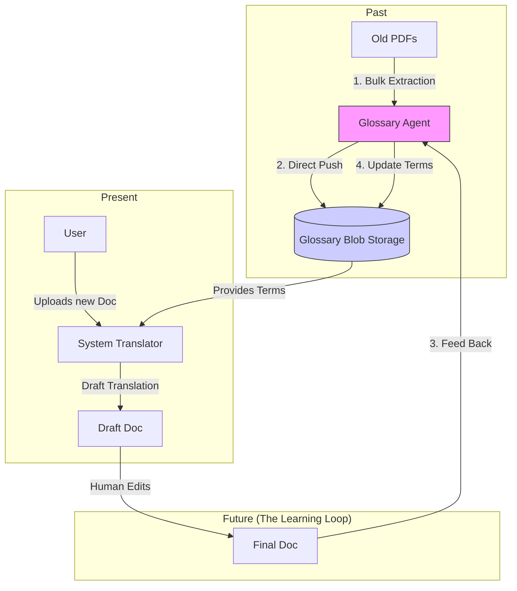

# Glossaries Agent Flow And Ponential Use Cases

To be used the glossaries potential to full , we not use as a Static tool upload and get to translate file like that, we use it as a dynamic tool to translate file by dynamic learning from the user uploaded files. It should be used as as memory of our system translation 

## The 3-Stage "Full Potential" Workflow

### Stage 1: Knowledge Mining (The "Cold Start")

*Use the existing documents to train the system immediately.*

1. **Bulk Scan**: Don't just scan one file. Point the agent at entire "Archived Contracts" folder
2. **Merge & Purge**: The agent will find duplicates. We need a simple script to merge these TSV files into one "Master Glossary"
3. **Result**: We instantly have a high quality glossary before we translate  a signle new file.

### State 2: One-Click "Smart Import"
*Remove friction of files.*

Currently, our flow is : `Agent -> Download TSV -> Upload To System Translation`

**Better Workflow** :

1. **Direct Databasee Push** : Modify `agentGlossaryController.js` to write the directly to our system translator's Azure Blob Storage (`glossaries` container).
2. **Metadata Tagging**: Auto-tag the glossary with the project name (e.g., "Engineering-Manual-v1").
3. **Result**: Users see the new glossary in the dropdown immediately after it generateion.

### Stage 3: The "Self-Driving" Feedback Loop

*This is the real game changer*

1. **Translate**: A user translates a document using the System Translator
2. **Correct**: A humman reviews fixes a mistake in the output file (e.g., change "khmer noodle" -> "នំបញ្ចុក")
3. **Learn**: The System Translator detects this change. It runs the **Glossary Agent** on the *newly corrected pair.*
4. **Update**: It adds  "khmer noodle" -> "នំបញ្ចុក" to the glossary automatically.
5. **Result**: The system getss smarter with every single document it processes.

## 🏗 Architecture Diagram

## For the next System Translation Ponential Future

To archieve this "Full Ponential":

1. **Refine the Agent**: We just did this! (Node,js port).
2. **Connect Backend**: Update our `System Translator ` backend to allow internal calls to `agentGlossaryController.js` (instead just HTTP calls).
3. **Build the "Merger"**: You need a small script to combine multiple TSV files and remove duplicates.

-----

## Deep Research Quesions :

### 1. What is Buld Scan ?

**Problem:** We have 5 years of "Archieved Contracts" PDFs sitting on our server. They contain valuable terminologies, but the system doesn't know it yet.

**Solution**:
* We write a script that says :  *"For every PDF in folder `D:\Archives\Contracts`, run the Glossary Agent."*
*   If you have 100 PDFs, the agent runs 100 times.
*   It produces 100 small `.tsv` files. This is "Mining" the gold from your old data.

### 2. What is "Merge & Purge"? (The "Master Database , Shift")

We will stop using  filess and start using a **Database**.

**The dynamics way**:

* we create **ONE SQL Table** called `GlossaryTerms`.
Columns : `SourceWord`, `TargetWord`,`LangPair`(e.g., 'en-km'),`Domain`(e.g., 'Engineering','Building','')

* **Merge**: When the bulk scan finishes, we import all 100 TSVs into this ONE table.
* **Purge**: If 50 files contian "hello" -> "ជំរាបសួរ"​ we need store only once.

### 3. How does "auto-tagging" work?

When we import terms intp the Database, we tag them.

* **Scenario** : User uploads a file named "Building Manual v1.pdf".
* **Action** : The Agent extracts terms and tags them with `Project: Building Manual v1` and `Domain: Building`.

* **Benifiit**: Latter, if someone translates another "Medical" document, the system prooritiezes these medical terms.

### 4. How does "Smart Review" work? (The feedback loop)

**Scenario**:

1. **AI Translate**: The system translates "Khmer Noodle" -> "មី" (wrong).
2. **User Review**: The user reviews the translation ouput , open the document in our editor and corrects it​​ "Khmer Noodle" -> "នំបញ្ចុក".

3. **The magic Step**:

* When the user saves the document translation, it compare Version AI vs Version User .
    * It sees the change: "មី" -> "នំបញ្ចុក"
    * It automatically sends this pair to the glossary agent to ask: Is this a glossary term?
        * if yes, it insert it into the glossary terms database
        * **next time**, the AI will get it right safety
### 5. Solving the "Selecting TSV" problem

**The fix: "Just-in-Time" glossaries**

With the Database approach, the user **never selects a file**.

1. User Uploads `Document_a.docx` and select target : Khmer.
2. **System Logic(Behind the scenes)**:
    * **Query**: The system asks the database : *Give me all English -> Khmer term for 'Legal' domain. *
* **Generate**: The system quickly writes these terms to a temporary file : `temp_glossary_domain_legal_en_km.tsv`
* **Upload**: It uploads this temp file to the Azure Blob Storage (invisible to the user)
 *   **Execute**: It calls **Azure Document Translation API**, passing the `temp_glossary_domain_legal_en_km.tsv` URL.
3.  **Result**: The user gets a perfectly formatted translated document. Azure uses the terms, but the user never had to manage the file!

4.  **Cleanup**: After the job is done, the **System deletes** 
`temp_glossary_domain_legal_en_km.tsv`

**This is the safe for production**:

Dynamics for many languages (en-km, km-en, en-fr...), won't caching be mess, 

**Use "Real-Time" (Just-in-Time)**

Why ?

*   **Complexity**: If you have 20 languages and 5 domains, you would need to manage **100 cached files**. That is a nightmare to maintain.
    *   **Speed**: Generating a glossary from a database takes **only ~0.5 seconds**.
    *   **Context**: A document translation takes 3-5 minutes. Users will **never notice** an extra 0.5 seconds at the start.

**Conclusion**: Keep it simple. Don't pre-generate files. Just generate them on-the-fly when the user clicks "Translate".
