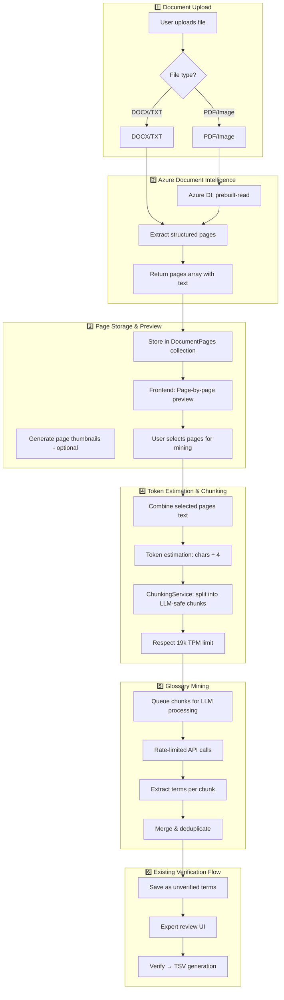
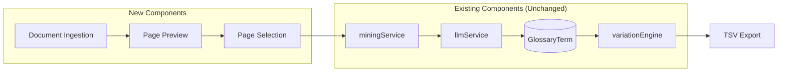
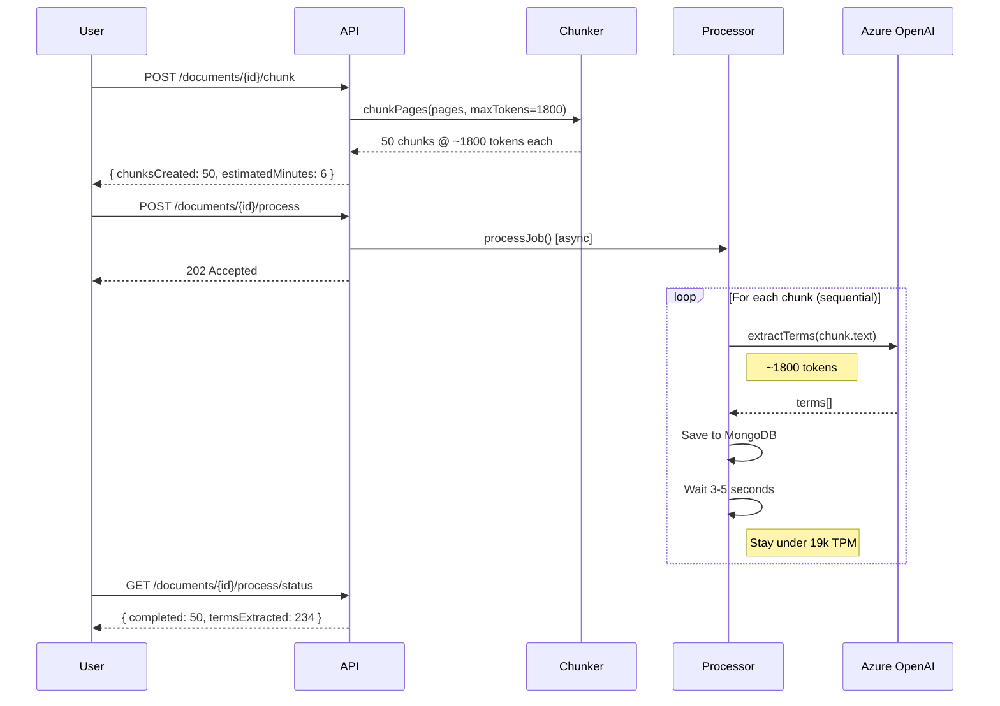
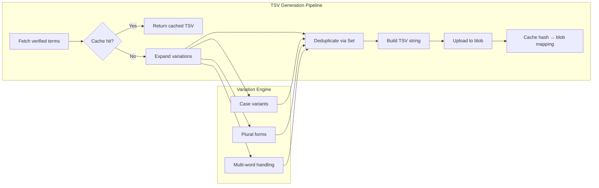
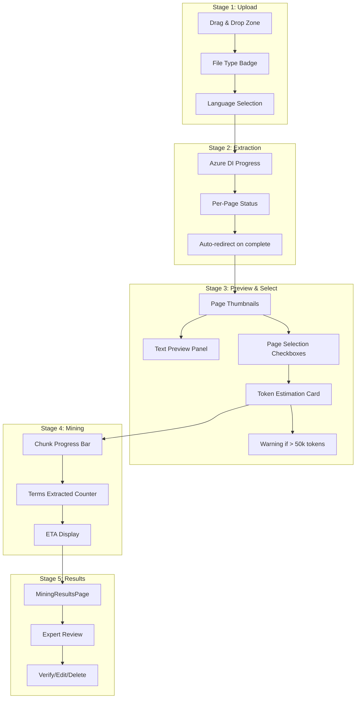

# Glossary System V2 - Point 1: Document Ingestion Layer Upgrade

## Overview

Upgrade the document ingestion pipeline to use **Azure Document Intelligence** for robust extraction from scanned PDFs, complex layouts, DOCX, and images. Add **page-by-page preview**, **user page selection**, and **LLM-safe chunking** while preserving all existing glossary verification rules.

## Current System Analysis

### Existing Infrastructure (Already Implemented ✅)

| Component | File | Capability |
|-----------|------|------------|
| Azure DI Integration | [PdfProcessorService.js](file:///d:/YorkMars/YQMS-V0.1/backend/services/PdfProcessorService.js) | Hybrid PDF extraction (digital vs scanned detection) |
| Chunking Engine | [ChunkingService.js](file:///d:/YorkMars/YQMS-V0.1/backend/services/ChunkingService.js) | Page-aware semantic chunking with overlap |
| Mining Service | [miningService.js](file:///d:/YorkMars/YQMS-V0.1/backend/services/miningService.js) | Term extraction orchestration |
| LLM Service | [llmService.js](file:///d:/YorkMars/YQMS-V0.1/backend/services/llmService.js) | Domain detection, term extraction, translation |
| Variation Engine | [variationEngine.js](file:///d:/YorkMars/YQMS-V0.1/backend/services/variationEngine.js) | Term variant generation + TSV building |
| GlossaryTerm Model | [GlossaryTerm.js](file:///d:/YorkMars/YQMS-V0.1/backend/models/GlossaryTerm.js) | MongoDB schema with verification workflow |

### Key Finding

> [!TIP]
> Your system **already has Azure Document Intelligence** integrated in [PdfProcessorService.js](file:///d:/YorkMars/YQMS-V0.1/backend/services/PdfProcessorService.js). The upgrade focuses on **enhanced user interaction** (page preview/selection) and **robust chunking** rather than core Azure DI integration.

---

## Proposed Architecture



---

## Proposed Changes

### Backend - Document Processing Layer

---

#### [NEW] [DocumentPage.js](file:///d:/YorkMars/YQMS-V0.1/backend/models/DocumentPage.js)

New MongoDB model to store extracted pages for preview and selection:

```javascript
{
    documentId: String,      // UUID linking all pages of a document
    fileName: String,        // Original filename
    fileType: String,        // pdf, docx, image, txt
    pageNumber: Number,      // 1-indexed
    text: String,            // Extracted text content
    charCount: Number,       // Character count
    tokenEstimate: Number,   // chars / 4
    extractionMethod: String, // "azure-di" | "pdf-parse" | "mammoth"
    createdAt: Date,
    expiresAt: Date          // Auto-delete after 24 hours (TTL index)
}
```

---

#### [MODIFY] [PdfProcessorService.js](file:///d:/YorkMars/YQMS-V0.1/backend/services/PdfProcessorService.js#L8-L153)

Expand to support DOCX and image files via Azure DI:

| Change | Description |
|--------|-------------|
| Add `extractFromDOCX()` | Use `mammoth` for DOCX text extraction |
| Add `extractFromImage()` | Send images to Azure DI for OCR |
| Refactor [extractText()](file:///d:/YorkMars/YQMS-V0.1/backend/controller/glossaries/glossaryController.js#888-908) | Router method that delegates by file type |
| Standardize output | All methods return `{ pages: [{pageNumber, text}] }` |

---

#### [NEW] [documentIngestionController.js](file:///d:/YorkMars/YQMS-V0.1/backend/controller/documentIngestionController.js)

New controller for the enhanced document ingestion workflow:

| Endpoint | Method | Description |
|----------|--------|-------------|
| `/api/documents/ingest` | POST | Upload file → Azure DI → store pages |
| `/api/documents/:documentId/pages` | GET | Get all pages for preview |
| `/api/documents/:documentId/pages/:pageNumber` | GET | Get single page text |
| `/api/documents/:documentId/estimate` | POST | Estimate tokens for selected pages |
| `/api/documents/:documentId/mine` | POST | Start mining with selected pages |

---

#### [MODIFY] [ChunkingService.js](file:///d:/YorkMars/YQMS-V0.1/backend/services/ChunkingService.js)

Add TPM-aware chunking:

```javascript
// New method
chunkForTPMLimit(pages, tpmLimit = 19000) {
    const MAX_TOKENS = Math.floor(tpmLimit * 0.8); // 80% safety margin
    // Split pages into batches that fit within token limit
    // Returns batches with estimated processing time
}
```

---

#### [MODIFY] [miningService.js](file:///d:/YorkMars/YQMS-V0.1/backend/services/miningService.js)

Add rate-limited batch processing:

```javascript
// New method
async mineWithRateLimit(chunks, options) {
    // Process chunks sequentially with delay between calls
    // Respect 19k TPM limit
    // Report progress after each chunk
}
```

---

### Backend - New Routes

---

#### [NEW] [documentRoutes.js](file:///d:/YorkMars/YQMS-V0.1/backend/routes/documentRoutes.js)

```javascript
router.post("/ingest", upload.single("file"), documentIngestionController.ingestDocument);
router.get("/:documentId/pages", documentIngestionController.getDocumentPages);
router.post("/:documentId/estimate", documentIngestionController.estimateTokens);
router.post("/:documentId/mine", documentIngestionController.mineSelectedPages);
```

---

### Frontend - Enhanced Mining UI

---

#### [MODIFY] [MiningUpload.jsx](file:///d:/YorkMars/YQMS-V0.1/src/components/system-translator/glossaries/MiningUpload.jsx)

Add page selection step:

| Change | Description |
|--------|-------------|
| Add document ingestion step | Call `/api/documents/ingest` on upload |
| Add `PagePreview` component | Show extracted text per page |
| Add page selection UI | Checkboxes to select pages for mining |
| Add token estimation display | Show estimated tokens & processing time |
| Add "Mine Selected Pages" button | Start mining with selected pages only |

---

#### [NEW] [PagePreview.jsx](file:///d:/YorkMars/YQMS-V0.1/src/components/system-translator/glossaries/PagePreview.jsx)

New component for page-by-page preview:

```jsx
<PagePreview 
    pages={extractedPages}
    selectedPages={selectedPages}
    onPageToggle={handlePageToggle}
    onSelectAll={handleSelectAll}
    tokenEstimate={totalTokens}
/>
```

Features:
- Page thumbnails with text preview
- Selection checkboxes
- Token estimate per page
- Total token count for selected pages
- Warning if exceeds safe processing limit

---

## Integration Points with Existing System



> [!IMPORTANT]
> All existing glossary verification rules remain unchanged. The upgrade only affects the **Document Ingestion Layer** (before term extraction).

---

## Verification Plan

### Automated Testing

1. **API Endpoint Tests** (Postman/Thunder Client)
   ```bash
   # Test document ingestion
   curl -X POST http://localhost:5001/api/documents/ingest \
     -F "file=@test.pdf" \
     -F "sourceLang=en" \
     -F "targetLang=km"
   
   # Test page retrieval
   curl http://localhost:5001/api/documents/{documentId}/pages
   
   # Test token estimation
   curl -X POST http://localhost:5001/api/documents/{documentId}/estimate \
     -H "Content-Type: application/json" \
     -d '{"selectedPages": [1, 2, 3]}'
   ```

2. **Chunking Service Unit Test**
   ```bash
   # Create test file: backend/services/__tests__/ChunkingService.test.js
   # Run with: npm test -- ChunkingService
   ```

### Manual Verification

1. **Upload Test Documents**
   - Upload a scanned PDF (should use Azure DI)
   - Upload a digital PDF (should use pdf-parse)
   - Upload a DOCX file
   - Upload an image file (PNG/JPG)

2. **Page Preview Verification**
   - Verify pages display correctly in preview
   - Check token estimates match character counts ÷ 4
   - Select/deselect pages and verify token total updates

3. **Mining Flow**
   - Select subset of pages → Start mining
   - Verify only selected pages are processed
   - Verify terms are saved as "unverified"
   - Verify existing verification workflow still works

---

## Implementation Order

| Phase | Components | Estimated Effort |
|-------|------------|------------------|
| **1** | `DocumentPage.js` model + TTL index | 1 hour |
| **2** | Enhanced [PdfProcessorService.js](file:///d:/YorkMars/YQMS-V0.1/backend/services/PdfProcessorService.js) | 2 hours |
| **3** | `documentIngestionController.js` + routes | 3 hours |
| **4** | TPM-aware [ChunkingService.js](file:///d:/YorkMars/YQMS-V0.1/backend/services/ChunkingService.js) | 1 hour |
| **5** | Rate-limited [miningService.js](file:///d:/YorkMars/YQMS-V0.1/backend/services/miningService.js) | 2 hours |
| **6** | `PagePreview.jsx` component | 2 hours |
| **7** | Enhanced [MiningUpload.jsx](file:///d:/YorkMars/YQMS-V0.1/src/components/system-translator/glossaries/MiningUpload.jsx) | 3 hours |
| **8** | Integration testing | 2 hours |

**Total Estimated: ~16 hours**

---

## Questions for User Review

1. **Page Preview Thumbnails**: Should we generate visual thumbnails for pages, or is text preview sufficient?

2. **Document Expiry**: The plan includes auto-deleting extracted pages after 24 hours. Is this acceptable, or should documents persist longer?

3. **Rate Limiting Strategy**: For 19k TPM limit, should we:
   - Process one chunk at a time with delays?
   - Queue chunks and process in background (with progress updates)?

4. **File Type Support**: Current plan covers PDF, DOCX, TXT, and images. Any other formats needed?

---

# Point 2: Azure Document Intelligence Backend Implementation

## Overview

Production-ready Node.js backend for Azure Document Intelligence integration with job tracking, per-page storage, and clean text extraction for LLM consumption.

---

## MongoDB Schemas

### [NEW] DocumentJob Model

File: [DocumentJob.js](file:///d:/YorkMars/YQMS-V0.1/backend/models/DocumentJob.js)

```javascript
import mongoose from "mongoose";

const documentJobSchema = new mongoose.Schema({
    // Unique job identifier
    jobId: {
        type: String,
        required: true,
        unique: true,
        index: true
    },
    
    // Original file info
    fileName: {
        type: String,
        required: true
    },
    fileType: {
        type: String,
        enum: ["pdf", "docx", "doc", "png", "jpg", "jpeg", "tiff", "bmp"],
        required: true
    },
    fileSizeBytes: {
        type: Number,
        required: true
    },
    
    // Azure Blob reference (if stored)
    blobUrl: {
        type: String,
        default: null
    },
    
    // Processing status
    status: {
        type: String,
        enum: ["uploaded", "extracting", "extracted", "failed"],
        default: "uploaded",
        index: true
    },
    
    // Azure DI operation details
    azureOperationId: {
        type: String,
        default: null
    },
    extractionMethod: {
        type: String,
        enum: ["azure-di", "pdf-parse", "mammoth"],
        default: null
    },
    
    // Results summary
    pageCount: {
        type: Number,
        default: 0
    },
    totalCharacters: {
        type: Number,
        default: 0
    },
    totalTokenEstimate: {
        type: Number,
        default: 0
    },
    
    // Mining context (optional - set when user proceeds to mining)
    sourceLang: String,
    targetLang: String,
    domain: String,
    project: String,
    
    // Error tracking
    errorMessage: {
        type: String,
        default: null
    },
    
    // Timestamps
    uploadedAt: {
        type: Date,
        default: Date.now
    },
    extractionStartedAt: Date,
    extractionCompletedAt: Date,
    
    // Auto-cleanup
    expiresAt: {
        type: Date,
        default: () => new Date(Date.now() + 24 * 60 * 60 * 1000), // 24 hours
        index: { expires: 0 } // TTL index
    }
}, {
    timestamps: true
});

// Query indexes
documentJobSchema.index({ status: 1, createdAt: -1 });
documentJobSchema.index({ uploadedAt: -1 });

const createDocumentJobModel = (connection) => {
    return connection.model("DocumentJob", documentJobSchema);
};

export default createDocumentJobModel;
```

---

### [NEW] DocumentPage Model

File: [DocumentPage.js](file:///d:/YorkMars/YQMS-V0.1/backend/models/DocumentPage.js)

```javascript
import mongoose from "mongoose";

const documentPageSchema = new mongoose.Schema({
    // Link to parent job
    jobId: {
        type: String,
        required: true,
        index: true
    },
    
    // Page identification
    pageNumber: {
        type: Number,
        required: true,
        min: 1
    },
    
    // Extracted content
    rawText: {
        type: String,
        required: true
    },
    cleanText: {
        type: String,
        required: true
    },
    
    // Metrics
    charCount: {
        type: Number,
        required: true
    },
    tokenEstimate: {
        type: Number,
        required: true
    },
    wordCount: {
        type: Number,
        default: 0
    },
    lineCount: {
        type: Number,
        default: 0
    },
    
    // Layout info (optional - from Azure DI)
    hasTable: {
        type: Boolean,
        default: false
    },
    tableCount: {
        type: Number,
        default: 0
    },
    paragraphCount: {
        type: Number,
        default: 0
    },
    
    // Selection tracking
    isSelected: {
        type: Boolean,
        default: true
    },
    
    // Auto-cleanup (same TTL as parent job)
    expiresAt: {
        type: Date,
        default: () => new Date(Date.now() + 24 * 60 * 60 * 1000),
        index: { expires: 0 }
    }
}, {
    timestamps: true
});

// Compound index for efficient page retrieval
documentPageSchema.index({ jobId: 1, pageNumber: 1 }, { unique: true });

const createDocumentPageModel = (connection) => {
    return connection.model("DocumentPage", documentPageSchema);
};

export default createDocumentPageModel;
```

---

## Enhanced Document Intelligence Service

File: [DocumentIntelligenceService.js](file:///d:/YorkMars/YQMS-V0.1/backend/services/DocumentIntelligenceService.js)

```javascript
/**
 * DocumentIntelligenceService.js
 * Production-ready Azure Document Intelligence integration
 * Handles PDF, DOCX, and image extraction with job tracking
 */

import DocumentIntelligence, { getLongRunningPoller, isUnexpected } from "@azure-rest/ai-document-intelligence";
import pdf from "pdf-parse";
import mammoth from "mammoth";
import { randomUUID } from "crypto";

const endpoint = process.env.DOCUMENT_INTELLIGENCE_ENDPOINT;
const apiKey = process.env.DOCUMENT_INTELLIGENCE_API_KEY;

// Token estimation: ~4 characters per token
const CHARS_PER_TOKEN = 4;

export class DocumentIntelligenceService {
    constructor() {
        if (!endpoint || !apiKey) {
            console.warn("[DocumentIntelligenceService] Azure DI credentials not configured");
        }
        this.client = endpoint && apiKey 
            ? DocumentIntelligence(endpoint, { key: apiKey })
            : null;
    }

    /**
     * Main entry point - extract document based on file type
     * @param {Buffer} fileBuffer - File content
     * @param {string} fileName - Original filename
     * @param {string} fileType - File extension (pdf, docx, png, etc.)
     * @returns {Promise<{ pages: Array, metadata: Object }>}
     */
    async extractDocument(fileBuffer, fileName, fileType) {
        const normalizedType = fileType.toLowerCase().replace(".", "");
        
        switch (normalizedType) {
            case "pdf":
                return await this.extractPdf(fileBuffer, fileName);
            case "docx":
            case "doc":
                return await this.extractDocx(fileBuffer, fileName);
            case "png":
            case "jpg":
            case "jpeg":
            case "tiff":
            case "bmp":
                return await this.extractImage(fileBuffer, fileName, normalizedType);
            case "txt":
                return await this.extractPlainText(fileBuffer, fileName);
            default:
                throw new Error(`Unsupported file type: ${fileType}`);
        }
    }

    /**
     * PDF extraction with hybrid approach (local for digital, Azure DI for scanned)
     */
    async extractPdf(fileBuffer, fileName) {
        // 1. Text density check
        let density = 0;
        let pdfData = null;

        try {
            pdfData = await pdf(fileBuffer);
            const textLength = pdfData.text ? pdfData.text.trim().length : 0;
            const numPages = pdfData.numpages || 1;
            density = numPages > 0 ? textLength / numPages : 0;
            console.log(`[DI Service] PDF density: ${density.toFixed(2)} chars/page`);
        } catch (err) {
            console.warn("[DI Service] PDF density check failed:", err.message);
            density = 0;
        }

        // 2. Choose extraction method
        if (density > 50) {
            console.log("[DI Service] Using local pdf-parse (digital PDF)");
            return await this.extractDigitalPdf(fileBuffer, fileName);
        } else {
            console.log("[DI Service] Using Azure DI (scanned/complex PDF)");
            return await this.extractWithAzureDI(fileBuffer, fileName, "pdf");
        }
    }

    /**
     * Local PDF extraction with page-aware rendering
     */
    async extractDigitalPdf(fileBuffer, fileName) {
        const pages = [];

        const renderPage = (pageData) => {
            return pageData.getTextContent().then(textContent => {
                let lastY = null;
                let text = "";
                
                for (const item of textContent.items) {
                    if (lastY === item.transform[5] || lastY === null) {
                        text += item.str;
                    } else {
                        text += "\n" + item.str;
                    }
                    lastY = item.transform[5];
                }
                
                pages.push({
                    pageNumber: pageData.pageIndex + 1,
                    rawText: text,
                    cleanText: this.cleanText(text)
                });
                return text;
            });
        };

        const data = await pdf(fileBuffer, { pagerender: renderPage });
        pages.sort((a, b) => a.pageNumber - b.pageNumber);

        // Enrich with metrics
        const enrichedPages = pages.map(p => this.enrichPageMetrics(p));

        return {
            pages: enrichedPages,
            metadata: {
                fileName,
                extractionMethod: "pdf-parse",
                pageCount: pages.length,
                totalCharacters: enrichedPages.reduce((sum, p) => sum + p.charCount, 0),
                totalTokenEstimate: enrichedPages.reduce((sum, p) => sum + p.tokenEstimate, 0)
            }
        };
    }

    /**
     * DOCX extraction using mammoth
     */
    async extractDocx(fileBuffer, fileName) {
        const result = await mammoth.extractRawText({ buffer: fileBuffer });
        const text = result.value || "";
        
        // DOCX doesn't have natural page breaks, so we create artificial pages
        // based on paragraph density (~3000 chars per page)
        const pages = this.splitTextIntoPages(text, 3000);

        return {
            pages: pages.map(p => this.enrichPageMetrics(p)),
            metadata: {
                fileName,
                extractionMethod: "mammoth",
                pageCount: pages.length,
                totalCharacters: text.length,
                totalTokenEstimate: Math.ceil(text.length / CHARS_PER_TOKEN)
            }
        };
    }

    /**
     * Image extraction via Azure DI OCR
     */
    async extractImage(fileBuffer, fileName, imageType) {
        return await this.extractWithAzureDI(fileBuffer, fileName, imageType);
    }

    /**
     * Plain text extraction
     */
    async extractPlainText(fileBuffer, fileName) {
        const text = fileBuffer.toString("utf-8");
        const pages = this.splitTextIntoPages(text, 3000);

        return {
            pages: pages.map(p => this.enrichPageMetrics(p)),
            metadata: {
                fileName,
                extractionMethod: "plaintext",
                pageCount: pages.length,
                totalCharacters: text.length,
                totalTokenEstimate: Math.ceil(text.length / CHARS_PER_TOKEN)
            }
        };
    }

    /**
     * Azure Document Intelligence extraction (for scanned PDFs and images)
     */
    async extractWithAzureDI(fileBuffer, fileName, fileType) {
        if (!this.client) {
            throw new Error("Azure Document Intelligence not configured");
        }

        const base64Source = fileBuffer.toString("base64");
        
        console.log(`[DI Service] Submitting ${fileType} to Azure DI...`);
        
        // Use prebuilt-layout for better structure extraction
        const initialResponse = await this.client
            .path("/documentModels/{modelId}:analyze", "prebuilt-layout")
            .post({
                contentType: "application/json",
                body: { base64Source }
            });

        if (isUnexpected(initialResponse)) {
            throw new Error(`Azure DI request failed: ${JSON.stringify(initialResponse.body)}`);
        }

        // Poll for completion
        const poller = await getLongRunningPoller(this.client, initialResponse);
        const result = await poller.pollUntilDone();

        if (!result.body?.analyzeResult) {
            throw new Error("Azure DI returned empty result");
        }

        const analyzeResult = result.body.analyzeResult;
        const fullContent = analyzeResult.content || "";
        const pages = [];

        // Process pages with paragraph/table awareness
        if (analyzeResult.pages) {
            for (const page of analyzeResult.pages) {
                const pageData = this.processAzureDIPage(page, analyzeResult, fullContent);
                pages.push(pageData);
            }
        }

        const enrichedPages = pages.map(p => this.enrichPageMetrics(p));

        return {
            pages: enrichedPages,
            metadata: {
                fileName,
                extractionMethod: "azure-di",
                pageCount: pages.length,
                totalCharacters: enrichedPages.reduce((sum, p) => sum + p.charCount, 0),
                totalTokenEstimate: enrichedPages.reduce((sum, p) => sum + p.tokenEstimate, 0),
                azureOperationId: result.body.operationId || null
            }
        };
    }

    /**
     * Process Azure DI page result with paragraph merging
     */
    processAzureDIPage(page, analyzeResult, fullContent) {
        let rawText = "";
        let paragraphCount = 0;
        let tableCount = 0;
        let hasTable = false;

        // Extract text from spans
        if (page.spans) {
            for (const span of page.spans) {
                rawText += fullContent.substring(span.offset, span.offset + span.length);
            }
        }

        // Count paragraphs in this page
        if (analyzeResult.paragraphs) {
            for (const para of analyzeResult.paragraphs) {
                if (para.boundingRegions?.some(r => r.pageNumber === page.pageNumber)) {
                    paragraphCount++;
                }
            }
        }

        // Count tables in this page
        if (analyzeResult.tables) {
            for (const table of analyzeResult.tables) {
                if (table.boundingRegions?.some(r => r.pageNumber === page.pageNumber)) {
                    tableCount++;
                    hasTable = true;
                }
            }
        }

        return {
            pageNumber: page.pageNumber,
            rawText,
            cleanText: this.cleanText(rawText),
            paragraphCount,
            tableCount,
            hasTable
        };
    }

    /**
     * Clean text for LLM consumption
     * Removes excessive whitespace, normalizes line breaks
     */
    cleanText(text) {
        if (!text) return "";
        
        return text
            // Normalize line endings
            .replace(/\r\n/g, "\n")
            .replace(/\r/g, "\n")
            // Remove excessive blank lines (keep max 2)
            .replace(/\n{3,}/g, "\n\n")
            // Remove leading/trailing whitespace from each line
            .split("\n")
            .map(line => line.trim())
            .join("\n")
            // Remove leading/trailing whitespace
            .trim();
    }

    /**
     * Enrich page with computed metrics
     */
    enrichPageMetrics(page) {
        const charCount = page.cleanText.length;
        const lines = page.cleanText.split("\n").filter(l => l.trim());
        const words = page.cleanText.split(/\s+/).filter(w => w.trim());

        return {
            ...page,
            charCount,
            tokenEstimate: Math.ceil(charCount / CHARS_PER_TOKEN),
            lineCount: lines.length,
            wordCount: words.length
        };
    }

    /**
     * Split text into artificial pages (for DOCX/TXT)
     */
    splitTextIntoPages(text, charsPerPage = 3000) {
        const pages = [];
        const paragraphs = text.split(/\n\s*\n/);
        let currentPage = { pageNumber: 1, rawText: "", cleanText: "" };
        let currentLength = 0;

        for (const para of paragraphs) {
            if (currentLength + para.length > charsPerPage && currentLength > 0) {
                currentPage.cleanText = this.cleanText(currentPage.rawText);
                pages.push(currentPage);
                currentPage = { pageNumber: pages.length + 1, rawText: "", cleanText: "" };
                currentLength = 0;
            }
            currentPage.rawText += (currentLength > 0 ? "\n\n" : "") + para;
            currentLength += para.length;
        }

        // Add last page
        if (currentPage.rawText) {
            currentPage.cleanText = this.cleanText(currentPage.rawText);
            pages.push(currentPage);
        }

        return pages;
    }
}

export const documentIntelligenceService = new DocumentIntelligenceService();
```

---

## Document Ingestion Controller

File: [documentIngestionController.js](file:///d:/YorkMars/YQMS-V0.1/backend/controller/documentIngestionController.js)

```javascript
/**
 * documentIngestionController.js
 * Handles document upload, extraction, and page management
 */

import { randomUUID } from "crypto";
import path from "path";
import { documentIntelligenceService } from "../services/DocumentIntelligenceService.js";
import { DocumentJob, DocumentPage } from "./MongoDB/dbConnectionController.js";

/**
 * POST /api/documents/ingest
 * Upload and extract document
 */
export async function ingestDocument(req, res) {
    try {
        if (!req.file) {
            return res.status(400).json({ 
                success: false, 
                error: "No file provided" 
            });
        }

        const { sourceLang, targetLang, domain, project } = req.body;
        const file = req.file;
        const fileExt = path.extname(file.originalname).toLowerCase().replace(".", "");
        const jobId = randomUUID();

        console.log(`[Ingest] Starting job ${jobId} for ${file.originalname}`);

        // 1. Create job record
        const job = await DocumentJob.create({
            jobId,
            fileName: file.originalname,
            fileType: fileExt,
            fileSizeBytes: file.size,
            status: "uploaded",
            sourceLang,
            targetLang,
            domain,
            project,
            uploadedAt: new Date()
        });

        // 2. Start extraction (async but we wait for it)
        await DocumentJob.updateOne(
            { jobId },
            { status: "extracting", extractionStartedAt: new Date() }
        );

        try {
            // 3. Extract document
            const result = await documentIntelligenceService.extractDocument(
                file.buffer,
                file.originalname,
                fileExt
            );

            // 4. Save pages to MongoDB
            const pageDocuments = result.pages.map(page => ({
                jobId,
                pageNumber: page.pageNumber,
                rawText: page.rawText,
                cleanText: page.cleanText,
                charCount: page.charCount,
                tokenEstimate: page.tokenEstimate,
                wordCount: page.wordCount || 0,
                lineCount: page.lineCount || 0,
                hasTable: page.hasTable || false,
                tableCount: page.tableCount || 0,
                paragraphCount: page.paragraphCount || 0,
                isSelected: true
            }));

            await DocumentPage.insertMany(pageDocuments);

            // 5. Update job with results
            await DocumentJob.updateOne(
                { jobId },
                {
                    status: "extracted",
                    extractionMethod: result.metadata.extractionMethod,
                    pageCount: result.metadata.pageCount,
                    totalCharacters: result.metadata.totalCharacters,
                    totalTokenEstimate: result.metadata.totalTokenEstimate,
                    azureOperationId: result.metadata.azureOperationId || null,
                    extractionCompletedAt: new Date()
                }
            );

            console.log(`[Ingest] Job ${jobId} completed: ${result.pages.length} pages extracted`);

            return res.status(200).json({
                success: true,
                jobId,
                fileName: file.originalname,
                status: "extracted",
                pageCount: result.pages.length,
                totalCharacters: result.metadata.totalCharacters,
                totalTokenEstimate: result.metadata.totalTokenEstimate,
                extractionMethod: result.metadata.extractionMethod,
                pages: result.pages.map(p => ({
                    pageNumber: p.pageNumber,
                    charCount: p.charCount,
                    tokenEstimate: p.tokenEstimate,
                    preview: p.cleanText.substring(0, 200) + (p.cleanText.length > 200 ? "..." : "")
                }))
            });

        } catch (extractionError) {
            // Update job with error
            await DocumentJob.updateOne(
                { jobId },
                {
                    status: "failed",
                    errorMessage: extractionError.message
                }
            );
            throw extractionError;
        }

    } catch (error) {
        console.error("[Ingest] Error:", error);
        return res.status(500).json({
            success: false,
            error: "Document ingestion failed",
            message: error.message
        });
    }
}

/**
 * GET /api/documents/:jobId/pages
 * Get all pages for a document
 */
export async function getDocumentPages(req, res) {
    try {
        const { jobId } = req.params;
        const { preview = "false" } = req.query;

        const job = await DocumentJob.findOne({ jobId });
        if (!job) {
            return res.status(404).json({ 
                success: false, 
                error: "Document not found" 
            });
        }

        const pages = await DocumentPage.find({ jobId })
            .sort({ pageNumber: 1 })
            .lean();

        const responsePages = pages.map(p => ({
            pageNumber: p.pageNumber,
            charCount: p.charCount,
            tokenEstimate: p.tokenEstimate,
            wordCount: p.wordCount,
            lineCount: p.lineCount,
            hasTable: p.hasTable,
            isSelected: p.isSelected,
            text: preview === "true" 
                ? p.cleanText.substring(0, 500) + (p.cleanText.length > 500 ? "..." : "")
                : p.cleanText
        }));

        return res.status(200).json({
            success: true,
            jobId,
            fileName: job.fileName,
            status: job.status,
            pageCount: pages.length,
            totalTokenEstimate: pages.reduce((sum, p) => sum + p.tokenEstimate, 0),
            pages: responsePages
        });

    } catch (error) {
        console.error("[GetPages] Error:", error);
        return res.status(500).json({
            success: false,
            error: "Failed to retrieve pages",
            message: error.message
        });
    }
}

/**
 * GET /api/documents/:jobId/pages/:pageNumber
 * Get single page content
 */
export async function getPageContent(req, res) {
    try {
        const { jobId, pageNumber } = req.params;

        const page = await DocumentPage.findOne({ 
            jobId, 
            pageNumber: parseInt(pageNumber) 
        });

        if (!page) {
            return res.status(404).json({ 
                success: false, 
                error: "Page not found" 
            });
        }

        return res.status(200).json({
            success: true,
            page: {
                pageNumber: page.pageNumber,
                rawText: page.rawText,
                cleanText: page.cleanText,
                charCount: page.charCount,
                tokenEstimate: page.tokenEstimate,
                wordCount: page.wordCount,
                lineCount: page.lineCount,
                hasTable: page.hasTable,
                tableCount: page.tableCount,
                paragraphCount: page.paragraphCount,
                isSelected: page.isSelected
            }
        });

    } catch (error) {
        console.error("[GetPage] Error:", error);
        return res.status(500).json({
            success: false,
            error: "Failed to retrieve page",
            message: error.message
        });
    }
}

/**
 * POST /api/documents/:jobId/estimate
 * Estimate tokens for selected pages
 */
export async function estimateTokens(req, res) {
    try {
        const { jobId } = req.params;
        const { selectedPages } = req.body; // Array of page numbers

        if (!selectedPages || !Array.isArray(selectedPages)) {
            return res.status(400).json({
                success: false,
                error: "selectedPages array is required"
            });
        }

        const pages = await DocumentPage.find({
            jobId,
            pageNumber: { $in: selectedPages }
        });

        const totalTokens = pages.reduce((sum, p) => sum + p.tokenEstimate, 0);
        const totalCharacters = pages.reduce((sum, p) => sum + p.charCount, 0);
        
        // Estimate processing with 19k TPM limit
        const TPM_LIMIT = 19000;
        const SAFETY_MARGIN = 0.8;
        const SAFE_TOKENS_PER_REQUEST = Math.floor(TPM_LIMIT * SAFETY_MARGIN);
        const estimatedChunks = Math.ceil(totalTokens / SAFE_TOKENS_PER_REQUEST);
        const estimatedMinutes = estimatedChunks; // ~1 minute per chunk at TPM limit

        return res.status(200).json({
            success: true,
            selectedPageCount: selectedPages.length,
            totalTokenEstimate: totalTokens,
            totalCharacters,
            processing: {
                estimatedChunks,
                estimatedMinutes,
                tpmLimit: TPM_LIMIT,
                safeTokensPerRequest: SAFE_TOKENS_PER_REQUEST
            },
            warning: totalTokens > 50000 
                ? "Large document - processing may take several minutes" 
                : null
        });

    } catch (error) {
        console.error("[Estimate] Error:", error);
        return res.status(500).json({
            success: false,
            error: "Token estimation failed",
            message: error.message
        });
    }
}

/**
 * PATCH /api/documents/:jobId/pages/selection
 * Update page selection
 */
export async function updatePageSelection(req, res) {
    try {
        const { jobId } = req.params;
        const { selectedPages } = req.body; // Array of page numbers to select

        // First, deselect all pages
        await DocumentPage.updateMany(
            { jobId },
            { isSelected: false }
        );

        // Then select the specified pages
        if (selectedPages && selectedPages.length > 0) {
            await DocumentPage.updateMany(
                { jobId, pageNumber: { $in: selectedPages } },
                { isSelected: true }
            );
        }

        const updatedPages = await DocumentPage.find({ jobId })
            .sort({ pageNumber: 1 })
            .select("pageNumber isSelected tokenEstimate");

        return res.status(200).json({
            success: true,
            selectedCount: selectedPages?.length || 0,
            totalPages: updatedPages.length,
            pages: updatedPages
        });

    } catch (error) {
        console.error("[UpdateSelection] Error:", error);
        return res.status(500).json({
            success: false,
            error: "Failed to update selection",
            message: error.message
        });
    }
}

/**
 * GET /api/documents/:jobId/status
 * Get job status
 */
export async function getJobStatus(req, res) {
    try {
        const { jobId } = req.params;

        const job = await DocumentJob.findOne({ jobId });
        if (!job) {
            return res.status(404).json({ 
                success: false, 
                error: "Job not found" 
            });
        }

        return res.status(200).json({
            success: true,
            job: {
                jobId: job.jobId,
                fileName: job.fileName,
                fileType: job.fileType,
                status: job.status,
                pageCount: job.pageCount,
                totalCharacters: job.totalCharacters,
                totalTokenEstimate: job.totalTokenEstimate,
                extractionMethod: job.extractionMethod,
                errorMessage: job.errorMessage,
                uploadedAt: job.uploadedAt,
                extractionStartedAt: job.extractionStartedAt,
                extractionCompletedAt: job.extractionCompletedAt
            }
        });

    } catch (error) {
        console.error("[GetStatus] Error:", error);
        return res.status(500).json({
            success: false,
            error: "Failed to get job status",
            message: error.message
        });
    }
}

export default {
    ingestDocument,
    getDocumentPages,
    getPageContent,
    estimateTokens,
    updatePageSelection,
    getJobStatus
};
```

---

## Express Routes

File: [documentRoutes.js](file:///d:/YorkMars/YQMS-V0.1/backend/routes/documentRoutes.js)

```javascript
/**
 * documentRoutes.js
 * Routes for document ingestion and page management
 */

import express from "express";
import multer from "multer";
import documentIngestionController from "../controller/documentIngestionController.js";

const router = express.Router();

// Configure multer for file uploads
const storage = multer.memoryStorage();
const upload = multer({
    storage,
    limits: {
        fileSize: 50 * 1024 * 1024 // 50MB limit
    },
    fileFilter: (req, file, cb) => {
        const allowedTypes = [
            "application/pdf",
            "application/vnd.openxmlformats-officedocument.wordprocessingml.document",
            "application/msword",
            "image/png",
            "image/jpeg",
            "image/tiff",
            "image/bmp",
            "text/plain"
        ];
        
        if (allowedTypes.includes(file.mimetype)) {
            cb(null, true);
        } else {
            cb(new Error(`Unsupported file type: ${file.mimetype}`), false);
        }
    }
});

// Routes
router.post("/ingest", upload.single("file"), documentIngestionController.ingestDocument);
router.get("/:jobId/status", documentIngestionController.getJobStatus);
router.get("/:jobId/pages", documentIngestionController.getDocumentPages);
router.get("/:jobId/pages/:pageNumber", documentIngestionController.getPageContent);
router.post("/:jobId/estimate", documentIngestionController.estimateTokens);
router.patch("/:jobId/pages/selection", documentIngestionController.updatePageSelection);

export default router;
```

---

## Register Routes in Server

Add to [server.js](file:///d:/YorkMars/YQMS-V0.1/backend/server.js):

```javascript
import documentRoutes from "./routes/documentRoutes.js";

// ... existing code ...

app.use("/api/documents", documentRoutes);
```

---

## Key Implementation Notes

> [!IMPORTANT]
> **Text Cleaning Strategy**: The `cleanText()` method normalizes whitespace and line breaks to produce LLM-ready text. Raw text is preserved for reference.

> [!TIP]
> **TTL Index**: Both `DocumentJob` and `DocumentPage` have 24-hour TTL indexes. MongoDB will automatically delete expired documents, preventing storage bloat.

### Paragraph/Line Merging Logic

The Azure DI Layout model returns granular text elements. The service merges them:

1. **Page spans** → Combined into page-level text
2. **Normalize line breaks** → `\r\n` → `\n`
3. **Remove excessive whitespace** → Max 2 consecutive blank lines
4. **Trim lines** → Remove leading/trailing spaces per line

This produces clean, readable text suitable for LLM consumption.

---

# Point 3: Token-Aware Chunking Engine

## Overview

A token-safe chunking service that splits extracted page texts into LLM-processable chunks (1,500–2,000 tokens), respects paragraph boundaries, stores chunks in MongoDB, and enables sequential processing to prevent TPM overload.

---

## MongoDB Schema

### [NEW] DocumentChunk Model

File: [DocumentChunk.js](file:///d:/YorkMars/YQMS-V0.1/backend/models/DocumentChunk.js)

```javascript
import mongoose from "mongoose";

const documentChunkSchema = new mongoose.Schema({
    // Link to parent job
    jobId: {
        type: String,
        required: true,
        index: true
    },
    
    // Chunk identification
    chunkIndex: {
        type: Number,
        required: true,
        min: 0
    },
    
    // Content
    text: {
        type: String,
        required: true
    },
    
    // Metrics
    charCount: {
        type: Number,
        required: true
    },
    tokenEstimate: {
        type: Number,
        required: true
    },
    
    // Source tracking
    pageRange: [{
        type: Number
    }],
    startPage: {
        type: Number,
        required: true
    },
    endPage: {
        type: Number,
        required: true
    },
    
    // Processing status
    status: {
        type: String,
        enum: ["pending", "processing", "completed", "failed"],
        default: "pending",
        index: true
    },
    
    // Mining results (populated after processing)
    termsExtracted: {
        type: Number,
        default: 0
    },
    processingTimeMs: {
        type: Number,
        default: null
    },
    errorMessage: {
        type: String,
        default: null
    },
    
    // Timestamps
    processedAt: {
        type: Date,
        default: null
    },
    
    // Auto-cleanup (same TTL as parent job)
    expiresAt: {
        type: Date,
        default: () => new Date(Date.now() + 24 * 60 * 60 * 1000),
        index: { expires: 0 }
    }
}, {
    timestamps: true
});

// Compound index for efficient chunk retrieval
documentChunkSchema.index({ jobId: 1, chunkIndex: 1 }, { unique: true });

// Index for finding unprocessed chunks
documentChunkSchema.index({ jobId: 1, status: 1 });

const createDocumentChunkModel = (connection) => {
    return connection.model("DocumentChunk", documentChunkSchema);
};

export default createDocumentChunkModel;
```

---

## Enhanced Token-Aware Chunking Service

File: [TokenAwareChunkingService.js](file:///d:/YorkMars/YQMS-V0.1/backend/services/TokenAwareChunkingService.js)

```javascript
/**
 * TokenAwareChunkingService.js
 * Token-safe chunking for LLM processing with paragraph preservation
 * Designed for 19k TPM limit with GPT-4o
 */

// Token estimation constants
const CHARS_PER_TOKEN = 4;  // Conservative estimate (actual varies by language)
const DEFAULT_MAX_TOKENS = 1800;  // Target 1,500-2,000 range
const MIN_TOKENS = 1500;
const MAX_TOKENS = 2000;

// TPM configuration
const TPM_LIMIT = 19000;
const SAFETY_MARGIN = 0.85;  // Use 85% of limit
const SAFE_TOKENS_PER_MINUTE = Math.floor(TPM_LIMIT * SAFETY_MARGIN);

export class TokenAwareChunkingService {
    
    /**
     * Estimate tokens from text
     * @param {string} text - Input text
     * @returns {number} - Estimated token count
     */
    estimateTokens(text) {
        if (!text) return 0;
        return Math.ceil(text.length / CHARS_PER_TOKEN);
    }

    /**
     * Main chunking method - splits pages into token-safe chunks
     * @param {Array<{pageNumber: number, cleanText: string}>} pages - Extracted pages
     * @param {Object} options - Chunking options
     * @returns {Array<Object>} - Array of chunks with metadata
     */
    chunkPages(pages, options = {}) {
        const {
            maxTokens = DEFAULT_MAX_TOKENS,
            preserveParagraphs = true,
            overlap = 0  // No overlap for glossary mining (avoid duplicate terms)
        } = options;

        if (!pages || pages.length === 0) return [];

        const MAX_CHARS = maxTokens * CHARS_PER_TOKEN;
        const chunks = [];
        
        let currentChunk = {
            text: "",
            pageRange: new Set(),
            startPage: null,
            endPage: null
        };

        for (const page of pages) {
            const pageText = page.cleanText || "";
            const pageNumber = page.pageNumber;

            // If page fits entirely in current chunk
            if (currentChunk.text.length + pageText.length + 2 <= MAX_CHARS) {
                this.appendToChunk(currentChunk, pageText, pageNumber);
            }
            // Page too big - need to split within page
            else if (pageText.length > MAX_CHARS) {
                // Finalize current chunk if it has content
                if (currentChunk.text.length > 0) {
                    chunks.push(this.finalizeChunk(currentChunk, chunks.length));
                    currentChunk = this.createEmptyChunk();
                }

                // Split large page into paragraphs
                const paragraphs = preserveParagraphs 
                    ? this.splitIntoParagraphs(pageText)
                    : [pageText];

                for (const para of paragraphs) {
                    if (para.length > MAX_CHARS) {
                        // Paragraph too large - split by sentences
                        const sentences = this.splitIntoSentences(para);
                        for (const sentence of sentences) {
                            if (currentChunk.text.length + sentence.length + 1 > MAX_CHARS) {
                                if (currentChunk.text.length > 0) {
                                    chunks.push(this.finalizeChunk(currentChunk, chunks.length));
                                    currentChunk = this.createEmptyChunk();
                                }
                            }
                            this.appendToChunk(currentChunk, sentence, pageNumber);
                        }
                    } else if (currentChunk.text.length + para.length + 2 > MAX_CHARS) {
                        // Paragraph doesn't fit - start new chunk
                        if (currentChunk.text.length > 0) {
                            chunks.push(this.finalizeChunk(currentChunk, chunks.length));
                            currentChunk = this.createEmptyChunk();
                        }
                        this.appendToChunk(currentChunk, para, pageNumber);
                    } else {
                        this.appendToChunk(currentChunk, para, pageNumber);
                    }
                }
            }
            // Current chunk would overflow - finalize and start new
            else {
                chunks.push(this.finalizeChunk(currentChunk, chunks.length));
                currentChunk = this.createEmptyChunk();
                this.appendToChunk(currentChunk, pageText, pageNumber);
            }
        }

        // Finalize last chunk
        if (currentChunk.text.length > 0) {
            chunks.push(this.finalizeChunk(currentChunk, chunks.length));
        }

        return chunks;
    }

    /**
     * Create empty chunk structure
     */
    createEmptyChunk() {
        return {
            text: "",
            pageRange: new Set(),
            startPage: null,
            endPage: null
        };
    }

    /**
     * Append text to chunk and track page range
     */
    appendToChunk(chunk, text, pageNumber) {
        if (chunk.text.length > 0) {
            chunk.text += "\n\n";
        }
        chunk.text += text;
        chunk.pageRange.add(pageNumber);
        
        if (chunk.startPage === null) {
            chunk.startPage = pageNumber;
        }
        chunk.endPage = pageNumber;
    }

    /**
     * Finalize chunk with computed metadata
     */
    finalizeChunk(chunk, index) {
        const text = chunk.text.trim();
        const charCount = text.length;
        
        return {
            chunkIndex: index,
            text,
            charCount,
            tokenEstimate: Math.ceil(charCount / CHARS_PER_TOKEN),
            pageRange: Array.from(chunk.pageRange).sort((a, b) => a - b),
            startPage: chunk.startPage,
            endPage: chunk.endPage,
            status: "pending"
        };
    }

    /**
     * Split text into paragraphs (preserving structure)
     */
    splitIntoParagraphs(text) {
        return text
            .split(/\n\s*\n/)
            .map(p => p.trim())
            .filter(p => p.length > 0);
    }

    /**
     * Split text into sentences (for very long paragraphs)
     */
    splitIntoSentences(text) {
        // Split on sentence-ending punctuation followed by space or newline
        const sentences = text.split(/(?<=[.!?])\s+/);
        return sentences.filter(s => s.trim().length > 0);
    }

    /**
     * Calculate processing estimates for TPM-aware scheduling
     * @param {Array<Object>} chunks - Array of chunks
     * @returns {Object} - Processing estimates
     */
    calculateProcessingEstimates(chunks) {
        const totalTokens = chunks.reduce((sum, c) => sum + c.tokenEstimate, 0);
        const avgTokensPerChunk = totalTokens / chunks.length;
        
        // How many chunks can we process per minute at safe TPM?
        const chunksPerMinute = Math.floor(SAFE_TOKENS_PER_MINUTE / avgTokensPerChunk);
        const estimatedMinutes = Math.ceil(chunks.length / Math.max(chunksPerMinute, 1));
        
        // Recommended delay between chunks (in ms)
        const delayBetweenChunks = Math.ceil(60000 / Math.max(chunksPerMinute, 1));

        return {
            totalChunks: chunks.length,
            totalTokens,
            avgTokensPerChunk: Math.round(avgTokensPerChunk),
            tpmLimit: TPM_LIMIT,
            safeTokensPerMinute: SAFE_TOKENS_PER_MINUTE,
            chunksPerMinute,
            estimatedMinutes,
            delayBetweenChunksMs: delayBetweenChunks
        };
    }

    /**
     * Chunk and save to MongoDB
     * @param {string} jobId - Document job ID
     * @param {Array} pages - Extracted pages
     * @param {Object} DocumentChunk - Mongoose model
     * @returns {Promise<Object>} - Chunking result
     */
    async chunkAndSave(jobId, pages, DocumentChunk, options = {}) {
        // Generate chunks
        const chunks = this.chunkPages(pages, options);
        
        // Prepare documents for MongoDB
        const chunkDocuments = chunks.map(chunk => ({
            jobId,
            chunkIndex: chunk.chunkIndex,
            text: chunk.text,
            charCount: chunk.charCount,
            tokenEstimate: chunk.tokenEstimate,
            pageRange: chunk.pageRange,
            startPage: chunk.startPage,
            endPage: chunk.endPage,
            status: "pending"
        }));

        // Save to MongoDB
        await DocumentChunk.insertMany(chunkDocuments);

        // Calculate estimates
        const estimates = this.calculateProcessingEstimates(chunks);

        return {
            jobId,
            chunksCreated: chunks.length,
            ...estimates
        };
    }
}

export const tokenAwareChunkingService = new TokenAwareChunkingService();
```

---

## Sequential Chunk Processor

File: [ChunkProcessorService.js](file:///d:/YorkMars/YQMS-V0.1/backend/services/ChunkProcessorService.js)

```javascript
/**
 * ChunkProcessorService.js
 * Sequential chunk processor with TPM-aware rate limiting
 * Processes chunks one-by-one to prevent LLM overload
 */

import { EventEmitter } from "events";

// TPM Configuration
const TPM_LIMIT = 19000;
const SAFETY_MARGIN = 0.85;
const MIN_DELAY_MS = 3000;  // Minimum 3 seconds between chunks
const MAX_DELAY_MS = 60000; // Maximum 1 minute delay

export class ChunkProcessorService extends EventEmitter {
    
    constructor() {
        super();
        this.isProcessing = false;
        this.currentJobId = null;
        this.abortController = null;
    }

    /**
     * Process all chunks for a job sequentially
     * @param {string} jobId - Document job ID
     * @param {Object} models - { DocumentChunk, GlossaryTerm }
     * @param {Object} services - { llmService, miningService }
     * @param {Object} options - Processing options
     */
    async processJob(jobId, models, services, options = {}) {
        const { DocumentChunk, GlossaryTerm } = models;
        const { llmService } = services;
        const { 
            sourceLang, 
            targetLang, 
            domain,
            project,
            onProgress
        } = options;

        if (this.isProcessing) {
            throw new Error("Another job is currently being processed");
        }

        this.isProcessing = true;
        this.currentJobId = jobId;
        this.abortController = new AbortController();

        try {
            // Get all pending chunks
            const chunks = await DocumentChunk.find({ 
                jobId, 
                status: "pending" 
            }).sort({ chunkIndex: 1 });

            if (chunks.length === 0) {
                return { success: true, message: "No pending chunks to process" };
            }

            const totalChunks = chunks.length;
            const totalTokens = chunks.reduce((sum, c) => sum + c.tokenEstimate, 0);
            
            // Calculate delay based on TPM
            const avgTokensPerChunk = totalTokens / totalChunks;
            const chunksPerMinute = Math.floor((TPM_LIMIT * SAFETY_MARGIN) / avgTokensPerChunk);
            const delayMs = Math.max(
                MIN_DELAY_MS, 
                Math.min(MAX_DELAY_MS, Math.ceil(60000 / chunksPerMinute))
            );

            console.log(`[ChunkProcessor] Starting job ${jobId}: ${totalChunks} chunks, ${delayMs}ms delay`);

            let processedCount = 0;
            let totalTermsExtracted = 0;
            const errors = [];

            for (const chunk of chunks) {
                // Check for abort
                if (this.abortController.signal.aborted) {
                    console.log(`[ChunkProcessor] Job ${jobId} aborted`);
                    break;
                }

                try {
                    // Mark as processing
                    await DocumentChunk.updateOne(
                        { _id: chunk._id },
                        { status: "processing" }
                    );

                    const startTime = Date.now();

                    // Extract terms from chunk using LLM
                    const extractedTerms = await llmService.extractTerms(
                        chunk.text,
                        sourceLang,
                        domain
                    );

                    // Translate terms if single-doc mode
                    const termsWithTranslation = await Promise.all(
                        extractedTerms.map(async (term) => {
                            const translation = await llmService.translateTerm(
                                term.term,
                                sourceLang,
                                targetLang,
                                domain,
                                term.evidenceSentence
                            );
                            return {
                                source: term.term,
                                target: translation.target,
                                confidenceScore: (term.confidence + translation.confidence) / 2,
                                category: term.category,
                                context: term.evidenceSentence
                            };
                        })
                    );

                    // Save terms to GlossaryTerm (unverified)
                    let insertedCount = 0;
                    for (const term of termsWithTranslation) {
                        try {
                            await GlossaryTerm.create({
                                source: term.source,
                                target: term.target,
                                sourceLang,
                                targetLang,
                                domain,
                                project,
                                createdBy: {
                                    agent: "agent-single-extraction",
                                    reviewerName: null
                                },
                                verificationStatus: "unverified",
                                confidenceScore: term.confidenceScore,
                                metadata: {
                                    sourceFile: `job:${jobId}`,
                                    context: term.context
                                },
                                miningBatchId: jobId
                            });
                            insertedCount++;
                        } catch (err) {
                            // Skip duplicates
                            if (err.code !== 11000) throw err;
                        }
                    }

                    const processingTime = Date.now() - startTime;

                    // Update chunk as completed
                    await DocumentChunk.updateOne(
                        { _id: chunk._id },
                        {
                            status: "completed",
                            termsExtracted: insertedCount,
                            processingTimeMs: processingTime,
                            processedAt: new Date()
                        }
                    );

                    processedCount++;
                    totalTermsExtracted += insertedCount;

                    // Emit progress
                    const progress = {
                        jobId,
                        processedChunks: processedCount,
                        totalChunks,
                        percentComplete: Math.round((processedCount / totalChunks) * 100),
                        termsExtracted: totalTermsExtracted,
                        currentChunk: chunk.chunkIndex,
                        chunkTerms: insertedCount
                    };
                    
                    this.emit("progress", progress);
                    if (onProgress) onProgress(progress);

                    console.log(`[ChunkProcessor] Chunk ${chunk.chunkIndex + 1}/${totalChunks}: ${insertedCount} terms (${processingTime}ms)`);

                    // Wait before next chunk (TPM rate limiting)
                    if (processedCount < totalChunks) {
                        await this.delay(delayMs);
                    }

                } catch (error) {
                    console.error(`[ChunkProcessor] Error on chunk ${chunk.chunkIndex}:`, error.message);
                    
                    await DocumentChunk.updateOne(
                        { _id: chunk._id },
                        {
                            status: "failed",
                            errorMessage: error.message
                        }
                    );

                    errors.push({
                        chunkIndex: chunk.chunkIndex,
                        error: error.message
                    });

                    // Continue to next chunk despite error
                }
            }

            return {
                success: true,
                jobId,
                processedChunks: processedCount,
                totalChunks,
                termsExtracted: totalTermsExtracted,
                errors: errors.length > 0 ? errors : undefined
            };

        } finally {
            this.isProcessing = false;
            this.currentJobId = null;
            this.abortController = null;
        }
    }

    /**
     * Abort current processing job
     */
    abort() {
        if (this.abortController) {
            this.abortController.abort();
        }
    }

    /**
     * Check if currently processing
     */
    getStatus() {
        return {
            isProcessing: this.isProcessing,
            currentJobId: this.currentJobId
        };
    }

    /**
     * Helper: delay with abort support
     */
    delay(ms) {
        return new Promise((resolve, reject) => {
            const timeout = setTimeout(resolve, ms);
            
            if (this.abortController) {
                this.abortController.signal.addEventListener("abort", () => {
                    clearTimeout(timeout);
                    resolve();
                });
            }
        });
    }
}

export const chunkProcessorService = new ChunkProcessorService();
```

---

## Updated Controller Endpoint

Add to [documentIngestionController.js](file:///d:/YorkMars/YQMS-V0.1/backend/controller/documentIngestionController.js):

```javascript
import { tokenAwareChunkingService } from "../services/TokenAwareChunkingService.js";
import { chunkProcessorService } from "../services/ChunkProcessorService.js";
import { DocumentChunk, GlossaryTerm } from "./MongoDB/dbConnectionController.js";
import llmService from "../services/llmService.js";

/**
 * POST /api/documents/:jobId/chunk
 * Create chunks from selected pages
 */
export async function createChunks(req, res) {
    try {
        const { jobId } = req.params;
        const { maxTokens = 1800 } = req.body;

        // Get selected pages
        const pages = await DocumentPage.find({ 
            jobId, 
            isSelected: true 
        }).sort({ pageNumber: 1 });

        if (pages.length === 0) {
            return res.status(400).json({
                success: false,
                error: "No pages selected for chunking"
            });
        }

        // Create chunks and save to MongoDB
        const result = await tokenAwareChunkingService.chunkAndSave(
            jobId,
            pages.map(p => ({ pageNumber: p.pageNumber, cleanText: p.cleanText })),
            DocumentChunk,
            { maxTokens }
        );

        return res.status(200).json({
            success: true,
            ...result
        });

    } catch (error) {
        console.error("[CreateChunks] Error:", error);
        return res.status(500).json({
            success: false,
            error: "Chunking failed",
            message: error.message
        });
    }
}

/**
 * POST /api/documents/:jobId/process
 * Start sequential chunk processing
 */
export async function processChunks(req, res) {
    try {
        const { jobId } = req.params;
        const { sourceLang, targetLang, domain, project } = req.body;

        if (!sourceLang || !targetLang) {
            return res.status(400).json({
                success: false,
                error: "sourceLang and targetLang are required"
            });
        }

        // Check if already processing
        const status = chunkProcessorService.getStatus();
        if (status.isProcessing) {
            return res.status(409).json({
                success: false,
                error: "Another job is currently processing",
                currentJobId: status.currentJobId
            });
        }

        // Start processing (async - returns immediately)
        chunkProcessorService.processJob(
            jobId,
            { DocumentChunk, GlossaryTerm },
            { llmService },
            { sourceLang, targetLang, domain, project }
        ).then(result => {
            console.log(`[Process] Job ${jobId} completed:`, result);
        }).catch(err => {
            console.error(`[Process] Job ${jobId} failed:`, err);
        });

        return res.status(202).json({
            success: true,
            message: "Processing started",
            jobId,
            statusEndpoint: `/api/documents/${jobId}/process/status`
        });

    } catch (error) {
        console.error("[ProcessChunks] Error:", error);
        return res.status(500).json({
            success: false,
            error: "Failed to start processing",
            message: error.message
        });
    }
}

/**
 * GET /api/documents/:jobId/process/status
 * Get processing status
 */
export async function getProcessingStatus(req, res) {
    try {
        const { jobId } = req.params;

        const chunks = await DocumentChunk.find({ jobId });
        const pending = chunks.filter(c => c.status === "pending").length;
        const processing = chunks.filter(c => c.status === "processing").length;
        const completed = chunks.filter(c => c.status === "completed").length;
        const failed = chunks.filter(c => c.status === "failed").length;

        const termsExtracted = chunks
            .filter(c => c.status === "completed")
            .reduce((sum, c) => sum + c.termsExtracted, 0);

        return res.status(200).json({
            success: true,
            jobId,
            totalChunks: chunks.length,
            status: {
                pending,
                processing,
                completed,
                failed
            },
            percentComplete: chunks.length > 0 
                ? Math.round((completed / chunks.length) * 100) 
                : 0,
            termsExtracted,
            isComplete: pending === 0 && processing === 0
        });

    } catch (error) {
        console.error("[GetProcessingStatus] Error:", error);
        return res.status(500).json({
            success: false,
            error: "Failed to get status",
            message: error.message
        });
    }
}
```

---

## How This Prevents TPM Issues



### TPM Prevention Strategy

| Strategy | Implementation |
|----------|----------------|
| **Small chunks** | Max 1,800–2,000 tokens per chunk (fits within TPM budget) |
| **Sequential processing** | One chunk at a time, never parallel |
| **Dynamic delay** | Calculate delay based on chunk size and TPM limit |
| **Safety margin** | Use only 85% of TPM limit for safety buffer |
| **Progress tracking** | Real-time status updates via MongoDB |

### Calculation Example

```
TPM Limit: 19,000
Safety Margin: 85% → 16,150 safe tokens/minute
Average Chunk: 1,800 tokens
Chunks per minute: 16,150 / 1,800 ≈ 9 chunks
Delay between chunks: 60,000ms / 9 ≈ 6,700ms
```

---

## New Routes

Add to [documentRoutes.js](file:///d:/YorkMars/YQMS-V0.1/backend/routes/documentRoutes.js):

```javascript
router.post("/:jobId/chunk", documentIngestionController.createChunks);
router.post("/:jobId/process", documentIngestionController.processChunks);
router.get("/:jobId/process/status", documentIngestionController.getProcessingStatus);
```

---

# Point 4: Glossary Agent Prompt Design (Review & Improvements)

## Current Implementation Review

Your existing prompts in [llmService.js](file:///d:/YorkMars/YQMS-V0.1/backend/services/llmService.js) are **well-structured**. Here's a review:

| Prompt | Current Status | Improvements Needed |
|--------|---------------|---------------------|
| Domain Detection | ✅ Good structure | Add negative examples, anti-hallucination rules |
| Term Extraction | ✅ Good rules | Add exclusion list, improve confidence criteria |
| Parallel Extraction | ✅ Strong | Add 0.85 threshold enforcement |
| Term Translation | ✅ Professional | Add domain-specific examples |

---

## Key Improvements Recommended

> [!IMPORTANT]
> **Anti-Hallucination Strategy**: Each prompt should explicitly state "NEVER invent terms not present in the text" and require evidence sentences.

### 1. Add Negative Examples
Tell the LLM what NOT to extract (reduces generic word extraction)

### 2. Enforce Confidence Thresholds in Prompts
Parallel mode: 0.85+ confidence for auto-accept, lower needs AI suggestion

### 3. Add Verification Status Awareness
Prompts should acknowledge that all outputs are "unverified"

### 4. Domain-Specific Stop Words
Add exclusion lists per domain to filter common words

---

## Enhanced Prompt A: Domain Detection

File: [llmService.js](file:///d:/YorkMars/YQMS-V0.1/backend/services/llmService.js#L85-L115) - [detectDomain()](file:///d:/YorkMars/YQMS-V0.1/backend/services/llmService.js#80-116)

```javascript
const userPrompt = `Classify the domain of this document. Return ONLY valid JSON.

DOCUMENT EXCERPT:
${text.slice(0, 2000)}

OUTPUT FORMAT (strict JSON):
{
    "domain": "Legal|Medical|Engineering|Building|Finance|IT|Garment Industry|General",
    "confidence": 0.0-1.0,
    "keywords": ["keyword1", "keyword2", "keyword3"],
    "reasoning": "Brief explanation of why this domain"
}

CLASSIFICATION RULES:
1. Choose EXACTLY ONE domain from the list
2. Confidence scoring:
   - 0.9+ : Multiple domain-specific terms found, clear domain
   - 0.7-0.89 : Some domain terms, moderate certainty
   - 0.5-0.69 : Few indicators, low certainty
   - <0.5 : Default to "General"
3. keywords = 3-5 domain-specific terms ACTUALLY FOUND in text
4. If document mixes domains, choose the PRIMARY one
5. NEVER guess domains from assumptions - only from text evidence

DOMAIN INDICATORS:
- Legal: contracts, clauses, parties, liability, jurisdiction
- Medical: diagnosis, treatment, patient, symptoms, medication
- Engineering: specifications, tolerances, materials, design
- Building: construction, foundations, structural, permits
- Finance: transactions, balance, investment, revenue
- IT: software, API, database, code, system
- Garment Industry: fabric, sewing, measurement, pattern, defect`;
```

---

## Enhanced Prompt B: Term Extraction (Single Doc)

```javascript
const userPrompt = `Extract domain-specific terminology from this ${domain} document chunk.

DOCUMENT (${getLangName(sourceLang)}):
${text}

OUTPUT FORMAT (strict JSON):
{
    "terms": [
        {
            "term": "exact term as found in text",
            "normalized": "lowercase/normalized form",
            "category": "noun|phrase|acronym|proper_noun|measurement",
            "confidence": 0.0-1.0,
            "evidenceSentence": "EXACT sentence from document containing the term"
        }
    ]
}

EXTRACTION RULES:
✅ INCLUDE:
- Technical terminology specific to ${domain}
- Multi-word terms (e.g., "intellectual property", "seam allowance")
- Acronyms WITH expansion if found (e.g., "SPI (Stitches Per Inch)")
- Industry-standard measurements and specifications
- Proper nouns that need consistent translation (product names, standards)

❌ EXCLUDE (NEVER extract):
- Common words: the, is, are, have, make, do, this, that
- Generic verbs: use, create, apply, perform, check
- Numbers alone (without context)
- Single letters or symbols
- Words with fewer than 3 characters
- Terms not actually in the text (NO HALLUCINATION)

CONFIDENCE SCORING:
- 0.9+ : Highly domain-specific, appears multiple times
- 0.7-0.89 : Domain-specific, appears at least once clearly
- 0.5-0.69 : Possibly domain-specific, needs review
- <0.5 : Uncertain, skip

DOMAIN-SPECIFIC STOP WORDS for ${domain}:
${getDomainStopWords(domain)}

CRITICAL: Every term MUST have an evidenceSentence that contains that EXACT term.
Maximum 25 terms per chunk.`;
```

**Helper function for domain stop words:**

```javascript
function getDomainStopWords(domain) {
    const stopWords = {
        "Garment Industry": "size, color, style, order, sample, delivery",
        "Legal": "document, section, page, date, signed, copy",
        "Medical": "patient, doctor, hospital, date, time, visit",
        "IT": "system, user, data, file, input, output",
        "General": "information, detail, item, thing, part"
    };
    return stopWords[domain] || stopWords["General"];
}
```

---

## Enhanced Prompt C: Parallel Bilingual Extraction

```javascript
const userPrompt = `Extract aligned terminology pairs from these parallel documents.

SOURCE DOCUMENT (${getLangName(sourceLang)}):
${sourceText}

TARGET DOCUMENT (${getLangName(targetLang)}):
${targetText}

DOMAIN: ${domain}

OUTPUT FORMAT (strict JSON):
{
    "pairs": [
        {
            "sourceTerm": "exact term from source text",
            "targetTermOriginal": "exact term from target text",
            "confidence": 0.0-1.0,
            "alignmentType": "exact|contextual|inferred",
            "evidenceSource": "source sentence containing term",
            "evidenceTarget": "target sentence containing term",
            "needsReview": false
        }
    ]
}

CONFIDENCE THRESHOLDS (CRITICAL):
- 0.85+ : HIGH CONFIDENCE - Term pair is reliable
  * Both terms appear clearly in their respective texts
  * Meaning alignment is obvious
  * needsReview = false
  
- 0.70-0.84 : MEDIUM CONFIDENCE - Needs expert review
  * Terms appear but alignment is uncertain
  * needsReview = true
  * AI should suggest targetTermSuggested if uncertain

- <0.70 : LOW CONFIDENCE - Suggest AI translation instead
  * Source term found, target uncertain
  * Include "targetTermSuggested" with AI's best guess
  * needsReview = true

EXTRACTION RULES:
1. Terms MUST actually appear in BOTH source AND target documents
2. DO NOT hallucinate terms that don't exist in the text
3. targetTermOriginal = EXACT text from target (no modifications)
4. Focus on ${domain}-specific vocabulary only
5. Maximum 20 pairs per chunk
6. Skip common words, articles, prepositions

ALIGNMENT TYPES:
- exact: Term found in same position/context in both texts
- contextual: Term found in parallel paragraphs
- inferred: Term alignment inferred from surrounding context

For pairs with confidence < 0.85, add:
{
    "targetTermSuggested": "AI's suggested translation",
    "suggestionReason": "Why this translation"
}`;
```

---

## Enhanced Prompt D: Term Translation

```javascript
const userPrompt = `Translate this ${domain} term from ${getLangName(sourceLang)} to ${getLangName(targetLang)}.

TERM: ${term}
DOMAIN: ${domain}
CONTEXT: ${context || 'No additional context provided'}

OUTPUT FORMAT (strict JSON):
{
    "target": "translated term",
    "confidence": 0.0-1.0,
    "alternatives": ["alternative1", "alternative2"],
    "no_translate": false,
    "translationType": "standard|technical|keep_original",
    "notes": "optional translation notes"
}

TRANSLATION RULES:
1. Use FORMAL/PROFESSIONAL register appropriate for ${domain}
2. Prefer ESTABLISHED ${domain} terminology over literal translation
3. If term is a proper noun, brand, or standard code → no_translate = true
4. Confidence scoring:
   - 0.9+ : Standard, well-established translation
   - 0.7-0.89 : Confident but alternatives exist
   - 0.5-0.69 : Uncertain, provide multiple alternatives
   - <0.5 : Very uncertain, flag for expert review

TRANSLATION TYPES:
- standard: Normal translation with equivalent meaning
- technical: Industry-specific term with exact equivalent
- keep_original: Term should remain in source language

DOMAIN-SPECIFIC GUIDANCE for ${domain}:
${getDomainTranslationGuidance(domain, targetLang)}

CRITICAL:
- All translations are UNVERIFIED and will be reviewed by experts
- Prefer accuracy over naturalness for technical terms
- Include alternatives for terms with multiple valid translations`;
```

**Helper for domain guidance:**

```javascript
function getDomainTranslationGuidance(domain, targetLang) {
    const guidance = {
        "Garment Industry": {
            "km": "Use Khmer garment industry standards. For measurements, keep metric units.",
            "zh": "Use Chinese textile industry terminology. Keep international standards in English."
        },
        "Legal": {
            "km": "Use formal Khmer legal terminology. Keep Latin terms as-is.",
            "zh": "Use standard Chinese legal terminology."
        }
    };
    return guidance[domain]?.[targetLang] || "Use professional register appropriate for the domain.";
}
```

---

## Prompt E: JSON Schema Definitions

### Output Schema Reference

```typescript
// Domain Detection Response
interface DomainDetectionResult {
    domain: "Legal" | "Medical" | "Engineering" | "Building" | "Finance" | "IT" | "Garment Industry" | "General";
    confidence: number;  // 0.0-1.0
    keywords: string[];  // 3-5 terms found
    reasoning?: string;  // Explanation
}

// Term Extraction Response (Single Doc)
interface TermExtractionResult {
    terms: Array<{
        term: string;           // Exact term from text
        normalized?: string;    // Lowercase form
        category: "noun" | "phrase" | "acronym" | "proper_noun" | "measurement";
        confidence: number;     // 0.0-1.0
        evidenceSentence: string;  // Source sentence
    }>;
}

// Parallel Extraction Response
interface ParallelExtractionResult {
    pairs: Array<{
        sourceTerm: string;
        targetTermOriginal: string;
        confidence: number;
        alignmentType: "exact" | "contextual" | "inferred";
        evidenceSource: string;
        evidenceTarget: string;
        needsReview: boolean;
        // For low confidence pairs:
        targetTermSuggested?: string;
        suggestionReason?: string;
    }>;
}

// Translation Response
interface TranslationResult {
    target: string;
    confidence: number;
    alternatives: string[];
    no_translate: boolean;
    translationType: "standard" | "technical" | "keep_original";
    notes?: string;
}
```

---

## Backend Validation

Add validation in [llmService.js](file:///d:/YorkMars/YQMS-V0.1/backend/services/llmService.js):

```javascript
/**
 * Validate parallel extraction result and apply confidence threshold
 * @param {Array} pairs - Extracted pairs from LLM
 * @param {number} threshold - Confidence threshold (default 0.85)
 */
function validateParallelPairs(pairs, threshold = 0.85) {
    return pairs.map(pair => {
        const isHighConfidence = pair.confidence >= threshold;
        
        return {
            ...pair,
            needsReview: !isHighConfidence,
            // If below threshold and no suggestion, mark for AI translation
            requiresAiTranslation: pair.confidence < 0.70 && !pair.targetTermSuggested
        };
    });
}

/**
 * Validate extracted terms (anti-hallucination check)
 * @param {Array} terms - Extracted terms
 * @param {string} originalText - Original document text
 */
function validateTermsExist(terms, originalText) {
    const textLower = originalText.toLowerCase();
    
    return terms.filter(term => {
        const termLower = term.term.toLowerCase();
        const exists = textLower.includes(termLower);
        
        if (!exists) {
            console.warn(`[LLM Validation] Term "${term.term}" not found in text - REJECTED`);
        }
        
        return exists;
    });
}
```

---

## Summary of Improvements

| Improvement | Purpose |
|-------------|---------|
| **Negative examples in prompts** | Reduce extraction of common words |
| **Domain stop words** | Filter known non-glossary terms per domain |
| **Evidence requirement** | Force LLM to cite exact sentences |
| **0.85 threshold in parallel prompt** | Clear handling of low-confidence pairs |
| **needsReview flag** | Automatic flagging for expert review |
| **Post-validation functions** | Verify terms exist in source text |
| **translationType field** | Better categorization for translation handling |

---

# Point 5: Variation Engine Design (Review & Improvements)

## Current Implementation Review

Your existing implementation in [variationEngine.js](file:///d:/YorkMars/YQMS-V0.1/backend/services/variationEngine.js) and [jitGlossaryService.js](file:///d:/YorkMars/YQMS-V0.1/backend/services/jitGlossaryService.js) are **well-designed** ✅

| Component | Current Status | Improvements |
|-----------|----------------|--------------|
| Case variations | ✅ lowercase, uppercase, title case | Add sentence case |
| Plural generation | ✅ Basic English rules | Add irregular plurals dictionary |
| In-memory cache | ✅ TTL-based Map | Add MongoDB persistent cache |
| TSV generation | ✅ Set-based deduplication | Good as-is |
| JIT caching | ✅ Hash-based blob caching | Excellent design |

---

## Recommended Improvements

### 1. Add Irregular Plurals Dictionary

Current implementation handles regular rules but misses common irregular plurals:

```javascript
// Add to variationEngine.js
const IRREGULAR_PLURALS = {
    // Common irregular nouns
    "child": "children",
    "person": "people",
    "man": "men",
    "woman": "women",
    "tooth": "teeth",
    "foot": "feet",
    "mouse": "mice",
    "goose": "geese",
    "analysis": "analyses",
    "criterion": "criteria",
    "datum": "data",
    "medium": "media",
    "appendix": "appendices",
    "index": "indices",
    // Industry-specific
    "defect": "defects",
    "specification": "specifications",
    "measurement": "measurements"
};

function generatePlurals(word) {
    const plurals = [];
    const lower = word.toLowerCase();

    // Check for irregular plural first
    if (IRREGULAR_PLURALS[lower]) {
        plurals.push(IRREGULAR_PLURALS[lower]);
        // Preserve original case
        if (word[0] === word[0].toUpperCase()) {
            plurals.push(toTitleCase(IRREGULAR_PLURALS[lower]));
        }
        return plurals;
    }

    // ... existing regular plural logic ...
}
```

---

### 2. Add Multi-Word Term Variations

For phrases, apply variations intelligently:

```javascript
/**
 * Generate variations for multi-word terms
 * @param {string} phrase - Multi-word term
 * @param {string} sourceLang - Language code
 * @returns {string[]} - Variations
 */
function expandMultiWordTerm(phrase, sourceLang) {
    const variants = new Set();
    const words = phrase.split(/\s+/);
    
    if (words.length === 1) {
        return expandSourceVariants(phrase, sourceLang);
    }

    // Original
    variants.add(phrase);
    
    // Case variations for full phrase
    variants.add(phrase.toLowerCase());
    variants.add(phrase.toUpperCase());
    variants.add(toTitleCase(phrase));
    variants.add(toSentenceCase(phrase));  // New!
    
    // For English: pluralize last word only
    if (sourceLang === 'en' && words.length > 1) {
        const lastWord = words[words.length - 1];
        const plurals = generatePlurals(lastWord);
        
        for (const plural of plurals) {
            const pluralPhrase = [...words.slice(0, -1), plural].join(' ');
            variants.add(pluralPhrase);
            variants.add(pluralPhrase.toLowerCase());
        }
    }
    
    return Array.from(variants);
}

/**
 * Sentence case: First letter uppercase, rest lowercase
 */
function toSentenceCase(str) {
    if (!str) return str;
    return str.charAt(0).toUpperCase() + str.slice(1).toLowerCase();
}
```

---

### 3. MongoDB Persistent Cache for Variations

Add persistent caching to survive server restarts:

```javascript
// New file: backend/models/VariationCache.js
import mongoose from "mongoose";

const variationCacheSchema = new mongoose.Schema({
    cacheKey: {
        type: String,
        required: true,
        unique: true,
        index: true
    },
    source: {
        type: String,
        required: true
    },
    sourceLang: {
        type: String,
        required: true
    },
    variants: [{
        type: String
    }],
    createdAt: {
        type: Date,
        default: Date.now,
        index: { expires: 604800 }  // 7 days TTL
    }
});

variationCacheSchema.index({ source: 1, sourceLang: 1 });

export default (connection) => connection.model("VariationCache", variationCacheSchema);
```

**Enhanced expandSourceVariants with MongoDB fallback:**

```javascript
import { VariationCache } from "./path/to/models.js";

// In-memory cache (fast path)
const MEMORY_CACHE = new Map();
const MEMORY_TTL_MS = 60 * 60 * 1000; // 1 hour

export async function expandSourceVariantsAsync(source, sourceLang) {
    const cacheKey = `${source}|${sourceLang}`;
    
    // 1. Check memory cache (fastest)
    const memCached = MEMORY_CACHE.get(cacheKey);
    if (memCached && Date.now() - memCached.timestamp < MEMORY_TTL_MS) {
        return memCached.variants;
    }
    
    // 2. Check MongoDB cache (survives restarts)
    try {
        const dbCached = await VariationCache.findOne({ cacheKey }).lean();
        if (dbCached) {
            // Populate memory cache
            MEMORY_CACHE.set(cacheKey, { 
                variants: dbCached.variants, 
                timestamp: Date.now() 
            });
            return dbCached.variants;
        }
    } catch (e) {
        console.warn("[VariationEngine] DB cache lookup failed:", e.message);
    }
    
    // 3. Generate variations
    const variants = generateVariants(source, sourceLang);
    
    // 4. Save to both caches
    MEMORY_CACHE.set(cacheKey, { variants, timestamp: Date.now() });
    
    try {
        await VariationCache.updateOne(
            { cacheKey },
            { cacheKey, source, sourceLang, variants },
            { upsert: true }
        );
    } catch (e) {
        // Non-critical - continue without DB cache
    }
    
    return variants;
}
```

---

### 4. Enhanced TSV Pipeline Integration



---

### 5. Deduplication Improvements

Current [buildTSV](file:///d:/YorkMars/YQMS-V0.1/backend/services/variationEngine.js#91-110) uses a Set which is correct. Add a warning for near-duplicates:

```javascript
export function buildTSV(terms, options = {}) {
    const { warnNearDuplicates = true } = options;
    const lines = new Set();
    const sourceMap = new Map(); // Track sources to detect near-duplicates
    
    for (const term of terms) {
        const sourceVariants = expandSourceVariants(term.source, term.sourceLang);
        
        for (const variant of sourceVariants) {
            const line = `${variant}\t${term.target}`;
            
            // Check for near-duplicates (same source, different target)
            if (warnNearDuplicates) {
                const existingTarget = sourceMap.get(variant.toLowerCase());
                if (existingTarget && existingTarget !== term.target) {
                    console.warn(
                        `[TSV] Near-duplicate: "${variant}" → "${existingTarget}" vs "${term.target}"`
                    );
                }
                sourceMap.set(variant.toLowerCase(), term.target);
            }
            
            lines.add(line);
        }
    }
    
    return Array.from(lines).join('\n');
}
```

---

## Example Outputs

### Input Term
```javascript
{ source: "Quality Control", target: "ការត្រួតពិនិត្យគុណភាព", sourceLang: "en" }
```

### Generated Variations
```
quality control → ការត្រួតពិនិត្យគុណភាព
QUALITY CONTROL → ការត្រួតពិនិត្យគុណភាព
Quality Control → ការត្រួតពិនិត្យគុណភាព
quality controls → ការត្រួតពិនិត្យគុណភាព
Quality Controls → ការត្រួតពិនិត្យគុណភាព
```

### TSV Output
```tsv
quality control	ការត្រួតពិនិត្យគុណភាព
QUALITY CONTROL	ការត្រួតពិនិត្យគុណភាព
Quality Control	ការត្រួតពិនិត្យគុណភាព
quality controls	ការត្រួតពិនិត្យគុណភាព
Quality Controls	ការត្រួតពិនិត្យគុណភាព
```

---

## Summary of Improvements

| Improvement | File | Purpose |
|-------------|------|---------|
| Irregular plurals dictionary | variationEngine.js | Handle words like child→children |
| Multi-word term variations | variationEngine.js | Smart phrase handling |
| Sentence case | variationEngine.js | Additional case variant |
| MongoDB persistent cache | VariationCache.js | Survive server restarts |
| Near-duplicate warnings | variationEngine.js | Catch conflicting translations |
| Async variation expansion | variationEngine.js | Enable DB cache fallback |

---

# Point 6: Frontend UX for Document Intelligence Flow

## Overview

Upgrade the glossary mining UI to include a **Document Intelligence Studio-style** extraction workflow with page preview, selection, token estimation, and progressive AI mining.

## Existing Components Review

| Component | Current Status | Upgrade Needed |
|-----------|----------------|----------------|
| [MiningUpload.jsx](file:///d:/YorkMars/YQMS-V0.1/src/components/system-translator/glossaries/MiningUpload.jsx) | ✅ File upload + mode selection | Add page preview step |
| [MiningProgressStepper.jsx](file:///d:/YorkMars/YQMS-V0.1/src/components/system-translator/glossaries/MiningProgressStepper.jsx) | ✅ 4-step progress | Add extraction step details |
| [MiningResultsPage.jsx](file:///d:/YorkMars/YQMS-V0.1/src/components/system-translator/glossaries/MiningResultsPage.jsx) | ✅ Expert review UI | Keep as-is (destination) |

---

## UX Flow Diagram



---

## Component Structure

### New Components

```
src/components/system-translator/glossaries/
├── DocumentIntelligenceFlow/
│   ├── DocumentIntelligenceFlow.jsx     # Main orchestrator
│   ├── UploadStage.jsx                  # Stage 1: Upload
│   ├── ExtractionProgress.jsx           # Stage 2: Azure DI progress
│   ├── PagePreviewPanel.jsx             # Stage 3: Preview & select
│   ├── PageThumbnail.jsx                # Individual page card
│   ├── TokenEstimationCard.jsx          # Token count + warnings
│   ├── MiningProgress.jsx               # Stage 4: Chunk processing
│   └── DocumentIntelligenceFlow.css     # Styles
├── MiningProgressStepper.jsx            # (Existing - enhanced)
└── MiningResultsPage.jsx                # (Existing - destination)
```

---

## State Management

### Main State (DocumentIntelligenceFlow.jsx)

```javascript
const [flowState, setFlowState] = useState({
    // Current stage
    stage: 'upload', // 'upload' | 'extracting' | 'preview' | 'mining' | 'complete'
    
    // Upload
    file: null,
    sourceLang: 'en',
    targetLang: 'km',
    domain: 'Garment Industry',
    
    // Extraction
    jobId: null,
    extractionProgress: { current: 0, total: 0, status: 'pending' },
    
    // Pages
    pages: [],           // Array of page data from backend
    selectedPages: [],   // Array of selected page numbers
    
    // Token estimation
    tokenEstimate: {
        total: 0,
        selectedCount: 0,
        estimatedChunks: 0,
        estimatedMinutes: 0,
        warning: null
    },
    
    // Mining
    miningProgress: {
        processedChunks: 0,
        totalChunks: 0,
        termsExtracted: 0,
        percentComplete: 0
    },
    
    // Result
    batchId: null,
    error: null
});
```

---

## Stage-by-Stage Implementation

### Stage 1: UploadStage.jsx

```jsx
export default function UploadStage({ onUploadComplete, sourceLang, targetLang, onLangChange }) {
    const [file, setFile] = useState(null);
    const [uploading, setUploading] = useState(false);

    const handleUpload = async () => {
        setUploading(true);
        const formData = new FormData();
        formData.append('file', file);
        formData.append('sourceLang', sourceLang);
        formData.append('targetLang', targetLang);

        const res = await fetch(`${API_BASE}/documents/ingest`, {
            method: 'POST',
            body: formData
        });
        const data = await res.json();
        
        if (data.success) {
            onUploadComplete(data.jobId, data.pages);
        }
    };

    return (
        <div className="upload-stage">
            <FileDropZone 
                onFileSelect={setFile}
                acceptedTypes=".pdf,.docx,.png,.jpg"
            />
            
            {file && (
                <div className="file-badge">
                    <FileIcon type={file.type} />
                    <span>{file.name}</span>
                    <span className="file-size">{formatBytes(file.size)}</span>
                </div>
            )}
            
            <div className="language-selectors">
                <LanguageSelect 
                    label="Source" 
                    value={sourceLang} 
                    onChange={(v) => onLangChange('source', v)} 
                />
                <ArrowRight />
                <LanguageSelect 
                    label="Target" 
                    value={targetLang} 
                    onChange={(v) => onLangChange('target', v)} 
                />
            </div>
            
            <Button 
                onClick={handleUpload} 
                disabled={!file || uploading}
                loading={uploading}
            >
                {uploading ? 'Analyzing...' : 'Analyze Document'}
            </Button>
        </div>
    );
}
```

---

### Stage 2: ExtractionProgress.jsx

```jsx
export default function ExtractionProgress({ jobId, onComplete }) {
    const [progress, setProgress] = useState({ status: 'extracting', pageCount: 0 });

    useEffect(() => {
        const interval = setInterval(async () => {
            const res = await fetch(`${API_BASE}/documents/${jobId}/status`);
            const data = await res.json();
            
            setProgress(data.job);
            
            if (data.job.status === 'extracted') {
                clearInterval(interval);
                onComplete(data.job);
            }
        }, 1000);
        
        return () => clearInterval(interval);
    }, [jobId]);

    return (
        <div className="extraction-progress">
            <div className="progress-visual">
                <Scan className="icon animate-pulse" />
                <h3>Analyzing with Azure Document Intelligence</h3>
            </div>
            
            <div className="status-card">
                <div className="status-row">
                    <span>Status</span>
                    <StatusBadge status={progress.status} />
                </div>
                <div className="status-row">
                    <span>Pages Detected</span>
                    <span className="count">{progress.pageCount}</span>
                </div>
                <div className="status-row">
                    <span>Method</span>
                    <span>{progress.extractionMethod || 'Detecting...'}</span>
                </div>
            </div>
            
            <LinearProgress indeterminate />
        </div>
    );
}
```

---

### Stage 3: PagePreviewPanel.jsx (Document Intelligence Studio Style)

```jsx
export default function PagePreviewPanel({ 
    pages, 
    selectedPages, 
    onSelectionChange,
    onStartMining 
}) {
    const [activePage, setActivePage] = useState(1);
    const [selectMode, setSelectMode] = useState('all'); // 'all' | 'range' | 'custom'

    const handleSelectAll = () => {
        onSelectionChange(pages.map(p => p.pageNumber));
        setSelectMode('all');
    };

    const handleSelectRange = (start, end) => {
        const range = pages
            .filter(p => p.pageNumber >= start && p.pageNumber <= end)
            .map(p => p.pageNumber);
        onSelectionChange(range);
        setSelectMode('range');
    };

    const handleTogglePage = (pageNum) => {
        const newSelection = selectedPages.includes(pageNum)
            ? selectedPages.filter(p => p !== pageNum)
            : [...selectedPages, pageNum];
        onSelectionChange(newSelection);
        setSelectMode('custom');
    };

    const selectedTokens = pages
        .filter(p => selectedPages.includes(p.pageNumber))
        .reduce((sum, p) => sum + p.tokenEstimate, 0);

    return (
        <div className="page-preview-panel">
            {/* Left: Page Thumbnails */}
            <div className="thumbnails-sidebar">
                <div className="selection-controls">
                    <Button size="sm" onClick={handleSelectAll}>Select All</Button>
                    <Button size="sm" variant="outline" onClick={() => onSelectionChange([])}>
                        Clear
                    </Button>
                </div>
                
                <div className="thumbnails-list">
                    {pages.map(page => (
                        <PageThumbnail
                            key={page.pageNumber}
                            page={page}
                            isSelected={selectedPages.includes(page.pageNumber)}
                            isActive={activePage === page.pageNumber}
                            onSelect={() => handleTogglePage(page.pageNumber)}
                            onClick={() => setActivePage(page.pageNumber)}
                        />
                    ))}
                </div>
            </div>
            
            {/* Center: Text Preview */}
            <div className="text-preview">
                <div className="preview-header">
                    <h4>Page {activePage}</h4>
                    <div className="page-stats">
                        <span>{pages.find(p => p.pageNumber === activePage)?.charCount} chars</span>
                        <span>~{pages.find(p => p.pageNumber === activePage)?.tokenEstimate} tokens</span>
                    </div>
                </div>
                
                <div className="preview-content">
                    <pre>{pages.find(p => p.pageNumber === activePage)?.text}</pre>
                </div>
            </div>
            
            {/* Right: Token Estimation */}
            <div className="estimation-sidebar">
                <TokenEstimationCard
                    selectedPages={selectedPages.length}
                    totalPages={pages.length}
                    totalTokens={selectedTokens}
                    onStartMining={onStartMining}
                />
            </div>
        </div>
    );
}
```

---

### TokenEstimationCard.jsx

```jsx
export default function TokenEstimationCard({ 
    selectedPages, 
    totalPages, 
    totalTokens,
    onStartMining 
}) {
    const TPM_LIMIT = 19000;
    const SAFE_CHUNK_SIZE = 1800;
    
    const estimatedChunks = Math.ceil(totalTokens / SAFE_CHUNK_SIZE);
    const estimatedMinutes = Math.ceil(estimatedChunks * 1.1); // ~1 min per chunk + buffer
    
    const isLarge = totalTokens > 50000;
    const isVeryLarge = totalTokens > 100000;

    return (
        <div className="token-estimation-card">
            <h4>Mining Estimation</h4>
            
            <div className="stat-grid">
                <div className="stat">
                    <span className="label">Selected Pages</span>
                    <span className="value">{selectedPages} / {totalPages}</span>
                </div>
                <div className="stat">
                    <span className="label">Total Tokens</span>
                    <span className="value">{totalTokens.toLocaleString()}</span>
                </div>
                <div className="stat">
                    <span className="label">Chunks</span>
                    <span className="value">{estimatedChunks}</span>
                </div>
                <div className="stat">
                    <span className="label">Est. Time</span>
                    <span className="value">~{estimatedMinutes} min</span>
                </div>
            </div>
            
            {isLarge && !isVeryLarge && (
                <div className="warning-banner">
                    <AlertTriangle />
                    <span>Large document. Mining may take {estimatedMinutes}+ minutes.</span>
                </div>
            )}
            
            {isVeryLarge && (
                <div className="error-banner">
                    <XCircle />
                    <span>Very large selection. Consider selecting fewer pages.</span>
                </div>
            )}
            
            <Button 
                className="start-mining-btn"
                onClick={onStartMining}
                disabled={selectedPages === 0 || isVeryLarge}
            >
                <BrainCircuit />
                Start Glossary Mining
            </Button>
        </div>
    );
}
```

---

### Stage 4: MiningProgress.jsx

```jsx
export default function MiningProgress({ jobId, onComplete }) {
    const [progress, setProgress] = useState({
        processedChunks: 0,
        totalChunks: 0,
        termsExtracted: 0,
        percentComplete: 0,
        isComplete: false
    });

    useEffect(() => {
        const interval = setInterval(async () => {
            const res = await fetch(`${API_BASE}/documents/${jobId}/process/status`);
            const data = await res.json();
            
            setProgress({
                processedChunks: data.status.completed,
                totalChunks: data.totalChunks,
                termsExtracted: data.termsExtracted,
                percentComplete: data.percentComplete,
                isComplete: data.isComplete
            });
            
            if (data.isComplete) {
                clearInterval(interval);
                onComplete(jobId);
            }
        }, 2000);
        
        return () => clearInterval(interval);
    }, [jobId]);

    return (
        <div className="mining-progress">
            <div className="progress-header">
                <BrainCircuit className="icon animate-pulse" />
                <h3>AI Mining in Progress</h3>
            </div>
            
            <div className="progress-bar-container">
                <div className="progress-bar">
                    <div 
                        className="progress-fill"
                        style={{ width: `${progress.percentComplete}%` }}
                    />
                </div>
                <span className="percentage">{progress.percentComplete}%</span>
            </div>
            
            <div className="stats-row">
                <div className="stat">
                    <span className="label">Chunks Processed</span>
                    <span className="value">{progress.processedChunks} / {progress.totalChunks}</span>
                </div>
                <div className="stat highlight">
                    <span className="label">Terms Extracted</span>
                    <span className="value">{progress.termsExtracted}</span>
                </div>
            </div>
            
            <p className="eta-message">
                Estimated ~{Math.ceil((progress.totalChunks - progress.processedChunks) * 1.1)} minutes remaining
            </p>
        </div>
    );
}
```

---

## Data Flow from Backend

| Stage | API Endpoint | Response Data |
|-------|--------------|---------------|
| 1. Upload | `POST /api/documents/ingest` | `{ jobId, status, pageCount, extractionMethod }` |
| 2. Extraction | `GET /api/documents/:jobId/status` | `{ status, pageCount, totalTokenEstimate }` |
| 3. Pages | `GET /api/documents/:jobId/pages?preview=true` | `{ pages: [{ pageNumber, text, tokenEstimate }] }` |
| 3. Estimate | `POST /api/documents/:jobId/estimate` | `{ totalTokens, estimatedChunks, estimatedMinutes }` |
| 4. Start | `POST /api/documents/:jobId/process` | `{ success, statusEndpoint }` |
| 4. Progress | `GET /api/documents/:jobId/process/status` | `{ percentComplete, termsExtracted, isComplete }` |
| 5. Results | Navigate to | `MiningResultsPage?batchId={jobId}` |

---

## UX Design Principles

> [!TIP]
> **Keep it Simple**: Use progressive disclosure - show only what's needed at each stage.

| Principle | Implementation |
|-----------|----------------|
| **Progressive Disclosure** | Show steps one at a time, hide complexity |
| **Clear Progress** | Always show where user is in the flow |
| **Token Warnings** | Warn early about large documents |
| **Estimated Time** | Set expectations for mining duration |
| **Non-Blocking** | Allow user to leave and check progress later |
| **Error Recovery** | Show clear error messages with retry options |

---

## CSS Styling Guidelines

```css
/* Document Intelligence Studio Style */
.document-intelligence-flow {
    display: grid;
    grid-template-columns: 1fr;
    gap: 2rem;
    max-width: 1400px;
    margin: 0 auto;
}

/* Page Preview Panel - 3-column layout */
.page-preview-panel {
    display: grid;
    grid-template-columns: 200px 1fr 280px;
    gap: 1rem;
    height: 70vh;
    background: var(--background);
    border-radius: 12px;
    border: 1px solid var(--border);
}

/* Thumbnails Sidebar */
.thumbnails-sidebar {
    overflow-y: auto;
    padding: 1rem;
    border-right: 1px solid var(--border);
}

/* Text Preview */
.text-preview {
    overflow-y: auto;
    padding: 1.5rem;
}

.text-preview pre {
    white-space: pre-wrap;
    font-family: 'Inter', sans-serif;
    line-height: 1.6;
}

/* Token Estimation Card */
.token-estimation-card {
    padding: 1.5rem;
    background: var(--card);
    border-left: 1px solid var(--border);
}

.warning-banner {
    background: #fef3cd;
    border: 1px solid #ffc107;
    color: #856404;
    padding: 0.75rem;
    border-radius: 8px;
    display: flex;
    align-items: center;
    gap: 0.5rem;
    margin: 1rem 0;
}

.start-mining-btn {
    width: 100%;
    padding: 1rem;
    font-size: 1rem;
    font-weight: 600;
    margin-top: 1.5rem;
}
```

---

## Summary

| New Component | Purpose |
|---------------|---------|
| `DocumentIntelligenceFlow.jsx` | Main flow orchestrator with stage management |
| `UploadStage.jsx` | File upload + language selection |
| `ExtractionProgress.jsx` | Azure DI extraction status |
| `PagePreviewPanel.jsx` | 3-column layout: thumbnails, preview, estimation |
| `TokenEstimationCard.jsx` | Token count, warnings, start button |
| `MiningProgress.jsx` | Chunk-by-chunk AI processing status |

---

# Implementation Summary

## All 6 Points Complete

| Point | Component | Status |
|-------|-----------|--------|
| 1 | Document Ingestion Layer Architecture | ✅ Designed |
| 2 | Azure Document Intelligence Backend | ✅ Full code |
| 3 | Token-Aware Chunking Engine | ✅ Full code |
| 4 | Glossary Agent Prompt Design | ✅ Enhanced |
| 5 | Variation Engine Design | ✅ Enhanced |
| 6 | Frontend UX (Document Intelligence Flow) | ✅ Designed |

## Files to Create/Modify

### New Files
- `backend/models/DocumentJob.js`
- `backend/models/DocumentPage.js`
- `backend/models/DocumentChunk.js`
- `backend/models/VariationCache.js`
- `backend/services/DocumentIntelligenceService.js`
- `backend/services/TokenAwareChunkingService.js`
- `backend/services/ChunkProcessorService.js`
- `backend/controller/documentIngestionController.js`
- `backend/routes/documentRoutes.js`
- `src/components/.../DocumentIntelligenceFlow/*.jsx`

### Modified Files
- [backend/services/llmService.js](file:///d:/YorkMars/YQMS-V0.1/backend/services/llmService.js) (enhanced prompts)
- [backend/services/variationEngine.js](file:///d:/YorkMars/YQMS-V0.1/backend/services/variationEngine.js) (improvements)
- [backend/server.js](file:///d:/YorkMars/YQMS-V0.1/backend/server.js) (register routes)
