# Expert-Managed Glossary System - Implementation Plan - Version 1

> **Consolidated from 10 Steps**: This plan combines all specifications into a cohesive, implementable design.

## Quick Reference - All 10 Steps Mapped

| Step | Topic | Plan Section | Key Deliverable |
|------|-------|--------------|-----------------|
| 1 | Context & Schema | §5 MongoDB | Updated [GlossaryTerm.js](file:///d:/YorkMars/YQMS-V0.1/backend/models/GlossaryTerm.js) with `createdBy` object |
| 2 | End-to-End Flow | §2 Architecture | 8-step flow diagram + responsibilities matrix |
| 3 | Backend APIs | §3 API Spec | 9 REST endpoints with RBAC, validation |
| 4 | Mining Logic | §4 Mining | `miningService.js` with single/parallel modes |
| 5 | UI Design | §8 UI Design | `MiningResultsPage.jsx` component |
| 6 | Verification Rules | §9 Verification | Auto-verify on edit, audit trail |
| 7 | Variation Engine | §10 Variation | `expandSourceVariants()` + `buildTSV()` |
| 8 | JIT TSV + Cache | §11 JIT TSV | Hash-based caching, auto-invalidation |
| 9 | LLM Prompts | §12 Prompts | 4 JSON-strict prompts |
| 10 | Hardening | §13 Hardening | Indexes, rate limits, audit logging |

---

## 1. System Overview

Design an **Expert-Managed Glossary System** where AI agents extract/translate terms but only **verified** terms by experts are used for Azure Document Translation.

### MongoDB Schema (as specified)

```javascript
{
    source: String,
    target: String,
    sourceLang: String,
    targetLang: String,
    domain: String,
    project: String,
    createdBy: {
        agent: "agent-parallel-extraction" | "agent-single-extraction" | "None",
        reviewerName: String | null
    },
    verificationStatus: "verified" | "unverified",
    confidenceScore: Number,  // 0 to 1
    createdAt: Date,
    updatedAt: Date
}
```

### Core Business Rules (must follow)

| Rule | Description |
|------|-------------|
| **R1** | AI agents extract/translate but CANNOT finalize without expert |
| **R2** | Agent-inserted terms default to `verificationStatus="unverified"` |
| **R3** | Expert tick verify → set `"verified"` |
| **R4** | Expert edits any field → **auto-set** `"verified"` |
| **R5** | Manual expert creation → `agent="None"`, auto `"verified"` |
| **R6** | Only `"verified"` terms used in translation TSV |
| **R7** | Parallel docs: suggest correction if confidence ≥ 0.70, never overwrite silently |
| **R8** | Single docs: agent translates, show in UI for correction before verify |
| **R9** | Variation Engine expands terms (case, plural) before TSV generation |

### Key Principles
1. **Trust but Verify**: AI does the heavy lifting; experts validate
2. **Verified-Only Translation**: Only `verificationStatus="verified"` terms in TSV
3. **Variation Expansion**: Auto-generate term forms (case variants, plurals)
4. **Audit Trail**: Track who created/verified each term

---

## 2. End-to-End System Flow & Architecture

### 2.1 High-Level Architecture


### 2.2 Step-by-Step End-to-End Flow

```mermaid
flowchart TD
    subgraph "STEP 1: Document Upload"
        A1[User uploads file via UI]
        A2{Single or Parallel?}
        A3[Single: source file only]
        A4[Parallel: source + target files]
    end

    subgraph "STEP 2: Text Extraction"
        B1[Backend receives file]
        B2{File type?}
        B3[PDF: pdf-extraction lib]
        B4[DOCX: mammoth lib]
        B5[TXT: direct read]
        B6[Extracted text chunks]
    end

    subgraph "STEP 3: Domain Detection"
        C1[Send first 2000 chars to LLM]
        C2[LLM returns domain + confidence]
        C3{Auto-detected or user override?}
        C4[Use detected domain]
        C5[Use user-specified domain]
    end

    subgraph "STEP 4: Term Mining"
        D1{Mining mode?}
        D2[Single Doc Mining]
        D3[Parallel Doc Mining]
        D4[Extract source terms]
        D5[Translate each term via LLM]
        D6[Align source/target sentences]
        D7[Extract bilingual pairs via LLM]
    end

    subgraph "STEP 5: Save to MongoDB"
        E1[For each term pair]
        E2{Duplicate check}
        E3[Skip if exists]
        E4[Insert with unverified status]
        E5[Set createdBy.agent]
        E6[Set confidenceScore]
    end

    subgraph "STEP 6: Expert Review"
        F1[Show Mining Results UI]
        F2[Expert reviews terms]
        F3{Action?}
        F4[Edit term → auto-verify]
        F5[Click verify checkbox]
        F6[Bulk verify selected]
        F7[Delete unwanted terms]
        F8[Update verificationStatus=verified]
    end

    subgraph "STEP 7: JIT TSV Generation"
        G1[Translation request received]
        G2[Query verified terms only]
        G3[Filter by lang pair + domain]
        G4[Variation Engine expands terms]
        G5[Generate TSV content]
    end

    subgraph "STEP 8: Azure Translation"
        H1[Upload TSV to temp blob]
        H2[Get SAS URL]
        H3[Call Azure Document Translation]
        H4[Poll for completion]
        H5[Download translated file]
        H6[Delete temp TSV blob]
        H7[Return to user]
    end

    A1 --> A2
    A2 -->|Single| A3
    A2 -->|Parallel| A4
    A3 --> B1
    A4 --> B1
    B1 --> B2
    B2 -->|PDF| B3
    B2 -->|DOCX| B4
    B2 -->|TXT| B5
    B3 --> B6
    B4 --> B6
    B5 --> B6
    B6 --> C1
    C1 --> C2
    C2 --> C3
    C3 -->|Auto| C4
    C3 -->|Override| C5
    C4 --> D1
    C5 --> D1
    D1 -->|Single| D2
    D1 -->|Parallel| D3
    D2 --> D4 --> D5
    D3 --> D6 --> D7
    D5 --> E1
    D7 --> E1
    E1 --> E2
    E2 -->|Exists| E3
    E2 -->|New| E4
    E4 --> E5 --> E6
    E6 --> F1
    F1 --> F2 --> F3
    F3 -->|Edit| F4
    F3 -->|Verify| F5
    F3 -->|Bulk| F6
    F3 -->|Delete| F7
    F4 --> F8
    F5 --> F8
    F6 --> F8
    F8 --> G1
    G1 --> G2 --> G3 --> G4 --> G5
    G5 --> H1 --> H2 --> H3 --> H4 --> H5 --> H6 --> H7
```



### 2.3 Responsibilities Matrix

| Step | Component | Responsibility |
|------|-----------|----------------|
| **Upload** | UI | File selection, validation, progress display |
| **Upload** | Backend | Multipart handling, temp file storage |
| **Text Extraction** | Backend | PDF/DOCX/TXT parsing via libs |
| **Domain Detection** | Agent (LLM) | Classify document domain |
| **Single Mining** | Agent (LLM) | Extract terms + translate |
| **Parallel Mining** | Agent (LLM) | Align + extract bilingual pairs |
| **Save Terms** | Backend | Duplicate check, MongoDB insert |
| **Review UI** | UI | Display terms, edit/verify controls |
| **Verification** | Backend | Update verificationStatus, audit |
| **TSV Generation** | Backend | Query verified, expand variations |
| **Blob Upload** | Backend | Azure Blob SDK operations |
| **Translation** | Azure API | Document translation with glossary |

### 2.4 Error Cases & Fallback Behaviors

| Error | Detection | Fallback |
|-------|-----------|----------|
| **File too large** | Backend: check `req.file.size > MAX_SIZE` | Return 413, show "File exceeds 50MB limit" |
| **Unsupported format** | Backend: check file extension | Return 400, list supported formats |
| **PDF extraction fails** | Try-catch around `pdf-extraction` | Return partial text + warning, or skip file |
| **LLM timeout** | Azure OpenAI timeout (30s) | Retry 2x with exponential backoff |
| **LLM rate limit** | 429 response | Queue request, retry after delay |
| **Domain detection low confidence** | `confidence < 0.5` | Default to "General", flag for user review |
| **Duplicate term** | MongoDB unique index error | Skip insert, log info, continue |
| **Blob upload fails** | Azure SDK error | Retry 2x, then fail translation gracefully |
| **Translation timeout** | Azure poll > 10min | Return timeout error, allow retry |

```javascript
// Error handling pattern
try {
    const result = await riskyOperation();
} catch (error) {
    if (error.code === 'ECONNRESET' || error.code === 'ETIMEDOUT') {
        // Network error - retry
        return await retryWithBackoff(riskyOperation, 3);
    }
    if (error.response?.status === 429) {
        // Rate limit - wait and retry
        await sleep(error.response.headers['retry-after'] * 1000);
        return await riskyOperation();
    }
    // Log and propagate
    console.error(`Operation failed: ${error.message}`);
    throw error;
}
```

---

## 3. Backend API Specification (Express)

### 3.1 API Endpoints Overview

| Method | Endpoint | Description | Auth |
|--------|----------|-------------|------|
| POST | `/api/glossary/mine/single` | Extract terms from single doc | Expert+ |
| POST | `/api/glossary/mine/parallel` | Extract terms from parallel docs | Expert+ |
| GET | `/api/glossary/terms` | List/filter terms | User+ |
| POST | `/api/glossary/terms` | Manual term creation | Expert+ |
| PATCH | `/api/glossary/terms/:id` | Edit term (auto-verify) | Expert+ |
| POST | `/api/glossary/terms/:id/verify` | Verify single term | Expert+ |
| POST | `/api/glossary/terms/bulk-verify` | Bulk verify terms | Expert+ |
| DELETE | `/api/glossary/terms/:id` | Delete term | Admin |
| GET | `/api/glossary/generate-tsv` | Generate TSV (verified only) | System |

### 3.2 RBAC Rules

```javascript
// middleware/rbac.js
const ROLES = {
    USER: 1,      // Can view terms only
    EXPERT: 2,    // Can mine, edit, verify terms
    ADMIN: 3      // Full access including delete
};

const requireRole = (minRole) => (req, res, next) => {
    const userRole = req.user?.role || ROLES.USER;
    if (userRole < minRole) {
        return res.status(403).json({ 
            error: "Forbidden", 
            message: `Requires ${Object.keys(ROLES).find(k => ROLES[k] === minRole)} role` 
        });
    }
    next();
};

// Route usage
router.post("/mine/single", requireRole(ROLES.EXPERT), mineSingleDoc);
router.delete("/terms/:id", requireRole(ROLES.ADMIN), deleteTerm);
```

### 3.3 Mining Endpoints

#### POST `/api/glossary/mine/single`

**Purpose**: Extract domain terms from a single document and translate to target language.

```javascript
// Request
{
    file: File,              // multipart/form-data
    sourceLang: "en",        // required
    targetLang: "km",        // required
    domain: "Legal",         // optional, auto-detect if omitted
    project: "Contract-v1"   // optional, defaults to filename
}

// Response 200
{
    success: true,
    miningId: "mine_abc123",
    domain: "Legal",         // detected or provided
    domainConfidence: 0.89,
    termsExtracted: 25,
    termsDuplicate: 3,       // skipped as already exist
    termsInserted: 22,
    insertedIds: ["id1", "id2", ...],
    terms: [
        {
            _id: "id1",
            source: "contract",
            target: "កិច្ចសន្យា",
            confidenceScore: 0.85,
            verificationStatus: "unverified",
            needsReview: false
        }
    ]
}

// Response 400 - Validation Error
{
    success: false,
    error: "Validation failed",
    details: [
        { field: "sourceLang", message: "Required field" },
        { field: "file", message: "Unsupported format. Use: pdf, docx, txt" }
    ]
}

// Response 500 - Processing Error
{
    success: false,
    error: "Mining failed",
    message: "LLM extraction timeout after 30s",
    partialTerms: 5  // if any were saved before failure
}
```

#### POST `/api/glossary/mine/parallel`

**Purpose**: Extract bilingual term pairs from aligned source and target documents.

```javascript
// Request
{
    sourceFile: File,        // multipart/form-data
    targetFile: File,        // multipart/form-data
    sourceLang: "en",        // required
    targetLang: "km",        // required
    domain: "Medical",       // optional
    project: "MedicalGuide"  // optional
}

// Response 200
{
    success: true,
    miningId: "mine_def456",
    domain: "Medical",
    domainConfidence: 0.92,
    alignmentScore: 0.88,    // how well sentences aligned
    termsExtracted: 40,
    termsWithLowConfidence: 8,  // confidence < 0.70
    insertedIds: ["id1", "id2", ...],
    terms: [
        {
            _id: "id1",
            source: "prescription",
            target: "វេជ្ជបញ្ជា",
            confidenceScore: 0.95,
            verificationStatus: "unverified",
            needsReview: false,
            context: "The prescription must be signed..."
        },
        {
            _id: "id2",
            source: "dosage",
            target: "កម្រិតថ្នាំ", 
            confidenceScore: 0.65,
            verificationStatus: "unverified",
            needsReview: true,  // < 0.70, needs expert review
            suggestedAlternatives: ["បរិមាណថ្នាំ"]
        }
    ]
}
```

### 3.4 Review & Verification Endpoints

#### GET `/api/glossary/terms`

**Purpose**: Query terms with filters for review or management.

```javascript
// Query Parameters
{
    sourceLang: "en",           // optional filter
    targetLang: "km",           // optional filter
    domain: "Legal",            // optional filter
    project: "Contract-v1",     // optional filter
    verificationStatus: "unverified",  // optional: verified|unverified
    search: "contract",         // optional: search in source/target
    confidenceMin: 0.5,         // optional: min confidence
    confidenceMax: 0.8,         // optional: max confidence
    createdBy: "agent-parallel-extraction",  // optional
    sortBy: "createdAt",        // default: createdAt
    sortOrder: "desc",          // asc|desc
    page: 1,                    // pagination
    limit: 50                   // max 100
}

// Response 200
{
    success: true,
    total: 156,
    page: 1,
    pages: 4,
    terms: [
        {
            _id: "id1",
            source: "contract",
            target: "កិច្ចសន្យា",
            sourceLang: "en",
            targetLang: "km",
            domain: "Legal",
            project: "Contract-v1",
            verificationStatus: "unverified",
            confidenceScore: 0.85,
            createdBy: {
                agent: "agent-parallel-extraction",
                reviewerName: null
            },
            createdAt: "2024-01-15T10:00:00Z",
            updatedAt: "2024-01-15T10:00:00Z"
        }
    ]
}
```

#### PATCH `/api/glossary/terms/:id`

**Purpose**: Edit a term. **Auto-sets `verificationStatus="verified"`** on any edit.

```javascript
// Request
{
    source: "contract",         // optional
    target: "កិច្ចសន្យាផ្លូវការ",  // optional - corrected translation
    domain: "Legal",            // optional
    reviewerName: "John Expert" // required for audit
}

// Response 200
{
    success: true,
    term: {
        _id: "id1",
        source: "contract",
        target: "កិច្ចសន្យាផ្លូវការ",
        domain: "Legal",
        verificationStatus: "verified",  // AUTO-SET
        createdBy: {
            agent: "agent-parallel-extraction",
            reviewerName: "John Expert"  // Updated
        },
        updatedAt: "2024-01-15T12:00:00Z"
    }
}

// Response 404
{
    success: false,
    error: "Term not found"
}
```

#### POST `/api/glossary/terms/:id/verify`

**Purpose**: Toggle verification status via checkbox.

```javascript
// Request
{
    verified: true,              // true = verified, false = unverified
    reviewerName: "John Expert"  // required
}

// Response 200
{
    success: true,
    term: {
        _id: "id1",
        verificationStatus: "verified",
        createdBy: {
            agent: "agent-parallel-extraction",
            reviewerName: "John Expert"
        },
        updatedAt: "2024-01-15T12:00:00Z"
    }
}
```

#### POST `/api/glossary/terms/bulk-verify`

**Purpose**: Verify multiple terms at once.

```javascript
// Request
{
    termIds: ["id1", "id2", "id3"],
    verified: true,
    reviewerName: "John Expert"
}

// Response 200
{
    success: true,
    updated: 3,
    failed: 0,
    results: [
        { _id: "id1", status: "updated" },
        { _id: "id2", status: "updated" },
        { _id: "id3", status: "updated" }
    ]
}

// Response 207 (Partial Success)
{
    success: true,
    updated: 2,
    failed: 1,
    results: [
        { _id: "id1", status: "updated" },
        { _id: "id2", status: "not_found" },
        { _id: "id3", status: "updated" }
    ]
}
```

#### DELETE `/api/glossary/terms/:id`

**Purpose**: Delete a term (Admin only).

```javascript
// Response 200
{
    success: true,
    message: "Term deleted",
    deletedId: "id1"
}

// Response 403
{
    success: false,
    error: "Forbidden",
    message: "Requires ADMIN role"
}
```

### 3.5 Validation Rules

```javascript
// validators/glossaryValidators.js
import Joi from 'joi';

const miningSchema = Joi.object({
    sourceLang: Joi.string().length(2).required(),
    targetLang: Joi.string().length(2).required(),
    domain: Joi.string().valid(
        'Legal', 'Medical', 'Engineering', 'Building', 
        'Finance', 'IT', 'General'
    ).optional(),
    project: Joi.string().max(200).optional()
});

const termUpdateSchema = Joi.object({
    source: Joi.string().min(1).max(500).optional(),
    target: Joi.string().min(1).max(500).optional(),
    domain: Joi.string().valid(
        'Legal', 'Medical', 'Engineering', 'Building', 
        'Finance', 'IT', 'General'
    ).optional(),
    reviewerName: Joi.string().required()
}).min(2); // At least reviewerName + one field

const bulkVerifySchema = Joi.object({
    termIds: Joi.array().items(Joi.string()).min(1).max(100).required(),
    verified: Joi.boolean().required(),
    reviewerName: Joi.string().required()
});
```

### 3.6 Error Response Format

```javascript
// All error responses follow this structure
{
    success: false,
    error: "ERROR_CODE",           // Machine-readable
    message: "Human-readable message",
    details: [...],                // Optional: field-level errors
    timestamp: "2024-01-15T12:00:00Z"
}

// Error codes
const ERROR_CODES = {
    VALIDATION_FAILED: 400,
    UNAUTHORIZED: 401,
    FORBIDDEN: 403,
    NOT_FOUND: 404,
    DUPLICATE_TERM: 409,
    FILE_TOO_LARGE: 413,
    RATE_LIMITED: 429,
    LLM_ERROR: 503,
    INTERNAL_ERROR: 500
};
```

---

## 4. Mining Logic Implementation

### 4.1 Module Architecture

```
backend/
├── services/
│   ├── miningService.js         # Main mining orchestrator
│   ├── textExtractor.js         # PDF/DOCX/TXT extraction
│   ├── domainDetector.js        # LLM domain classification
│   ├── termExtractor.js         # LLM term extraction
│   ├── termTranslator.js        # LLM term translation
│   └── sentenceAligner.js       # Parallel doc alignment
├── controller/glossaries/
│   └── miningController.js      # Express route handlers
└── prompts/
    ├── domainDetection.txt
    ├── singleExtraction.txt
    ├── parallelExtraction.txt
    └── termTranslation.txt
```

### 4.2 Single Document Mining - Pseudocode

```
FUNCTION mineSingleDocument(file, sourceLang, targetLang, domain, project):
    
    // STEP 1: Extract text from file
    text = extractText(file)
    IF text.length < 100:
        THROW Error("Document too short for mining")
    
    // STEP 2: Detect domain if not provided
    IF domain IS NULL:
        domainResult = detectDomain(text.substring(0, 2000))
        domain = domainResult.domain
        domainConfidence = domainResult.confidence
    
    // STEP 3: Chunk text for LLM processing
    chunks = splitIntoChunks(text, MAX_CHUNK_SIZE=4000)
    
    // STEP 4: Extract source terms from each chunk
    allTerms = []
    FOR EACH chunk IN chunks:
        extractedTerms = extractTermsFromChunk(chunk, sourceLang, domain)
        allTerms.append(extractedTerms)
    
    // STEP 5: Deduplicate extracted terms
    uniqueTerms = deduplicateTerms(allTerms)
    
    // STEP 6: Translate each term
    FOR EACH term IN uniqueTerms:
        translationResult = translateTerm(
            term.source, 
            sourceLang, 
            targetLang, 
            domain
        )
        term.target = translationResult.translation
        term.confidenceScore = translationResult.confidence
        term.alternatives = translationResult.alternatives
    
    // STEP 7: Save to MongoDB
    insertedIds = []
    FOR EACH term IN uniqueTerms:
        doc = {
            source: term.source,
            target: term.target,
            sourceLang: sourceLang,
            targetLang: targetLang,
            domain: domain,
            project: project OR extractFilename(file),
            createdBy: {
                agent: "agent-single-extraction",
                reviewerName: null
            },
            verificationStatus: "unverified",
            confidenceScore: term.confidenceScore,
            metadata: {
                sourceFile: file.name,
                context: term.context
            }
        }
        
        TRY:
            result = MongoDB.glossaryterms.insertOne(doc)
            insertedIds.append(result.insertedId)
        CATCH DuplicateKeyError:
            // Skip duplicates silently
            CONTINUE
    
    RETURN {
        domain: domain,
        termsExtracted: uniqueTerms.length,
        termsInserted: insertedIds.length,
        insertedIds: insertedIds,
        terms: enrichWithReviewFlags(uniqueTerms)
    }
```

### 4.3 Parallel Document Mining - Pseudocode

```
FUNCTION mineParallelDocuments(sourceFile, targetFile, sourceLang, targetLang, domain, project):
    
    // STEP 1: Extract text from both files
    sourceText = extractText(sourceFile)
    targetText = extractText(targetFile)
    
    // STEP 2: Detect domain if not provided
    IF domain IS NULL:
        domainResult = detectDomain(sourceText.substring(0, 2000))
        domain = domainResult.domain
    
    // STEP 3: Align sentences between source and target
    alignedPairs = alignSentences(sourceText, targetText, sourceLang, targetLang)
    alignmentScore = calculateAlignmentScore(alignedPairs)
    
    // STEP 4: Chunk aligned pairs for LLM processing
    chunks = chunkAlignedPairs(alignedPairs, MAX_PAIRS_PER_CHUNK=20)
    
    // STEP 5: Extract bilingual terms from each chunk
    allTerms = []
    FOR EACH chunk IN chunks:
        sourceChunk = chunk.map(p => p.source).join("\n")
        targetChunk = chunk.map(p => p.target).join("\n")
        
        extractedTerms = extractParallelTerms(
            sourceChunk, 
            targetChunk, 
            sourceLang, 
            targetLang,
            domain
        )
        allTerms.append(extractedTerms)
    
    // STEP 6: Deduplicate and validate
    uniqueTerms = deduplicateTerms(allTerms)
    
    // STEP 7: Apply confidence threshold policy
    FOR EACH term IN uniqueTerms:
        IF term.confidenceScore < 0.70:
            term.needsReview = true
            term.reviewReason = "Low confidence - expert verification required"
            // NEVER AUTO-OVERWRITE: just flag for review
        ELSE:
            term.needsReview = false
    
    // STEP 8: Save to MongoDB
    insertedIds = []
    FOR EACH term IN uniqueTerms:
        doc = {
            source: term.source,
            target: term.target,  // From parallel doc, trusted but unverified
            sourceLang: sourceLang,
            targetLang: targetLang,
            domain: domain,
            project: project OR extractFilename(sourceFile),
            createdBy: {
                agent: "agent-parallel-extraction",
                reviewerName: null
            },
            verificationStatus: "unverified",
            confidenceScore: term.confidenceScore,
            metadata: {
                sourceFile: sourceFile.name,
                context: term.context
            }
        }
        
        TRY:
            result = MongoDB.glossaryterms.insertOne(doc)
            insertedIds.append(result.insertedId)
        CATCH DuplicateKeyError:
            CONTINUE
    
    RETURN {
        domain: domain,
        alignmentScore: alignmentScore,
        termsExtracted: uniqueTerms.length,
        termsWithLowConfidence: uniqueTerms.filter(t => t.needsReview).length,
        insertedIds: insertedIds,
        terms: uniqueTerms
    }
```

### 4.4 Node.js Implementation

```javascript
// backend/services/miningService.js

import { extractText } from './textExtractor.js';
import { detectDomain } from './domainDetector.js';
import { extractTerms, extractParallelTerms } from './termExtractor.js';
import { translateTerm } from './termTranslator.js';
import { alignSentences } from './sentenceAligner.js';
import { GlossaryTerm } from '../controller/MongoDB/dbConnectionController.js';

const MAX_CHUNK_SIZE = 4000;
const CONFIDENCE_THRESHOLD = 0.70;

/**
 * Mine terms from a single document
 */
export async function mineSingleDocument({
    fileBuffer,
    fileName,
    sourceLang,
    targetLang,
    domain = null,
    project = null
}) {
    // 1. Extract text
    const text = await extractText(fileBuffer, fileName);
    if (text.length < 100) {
        throw new Error('Document too short for meaningful mining');
    }

    // 2. Detect domain if not provided
    let detectedDomain = domain;
    let domainConfidence = 1.0;
    if (!domain) {
        const domainResult = await detectDomain(text.slice(0, 2000));
        detectedDomain = domainResult.domain;
        domainConfidence = domainResult.confidence;
    }

    // 3. Extract terms in chunks
    const chunks = splitIntoChunks(text, MAX_CHUNK_SIZE);
    const allTerms = [];
    
    for (const chunk of chunks) {
        const terms = await extractTerms(chunk, sourceLang, detectedDomain);
        allTerms.push(...terms);
    }

    // 4. Deduplicate
    const uniqueTerms = deduplicateBySource(allTerms);

    // 5. Translate each term
    for (const term of uniqueTerms) {
        const translation = await translateTerm(
            term.source,
            sourceLang,
            targetLang,
            detectedDomain
        );
        term.target = translation.translation;
        term.confidenceScore = translation.confidence;
        term.alternatives = translation.alternatives || [];
    }

    // 6. Save to MongoDB
    const insertedIds = [];
    const projectName = project || fileName.replace(/\.[^.]+$/, '');

    for (const term of uniqueTerms) {
        try {
            const doc = {
                source: term.source,
                target: term.target,
                sourceLang,
                targetLang,
                domain: detectedDomain,
                project: projectName,
                createdBy: {
                    agent: 'agent-single-extraction',
                    reviewerName: null
                },
                verificationStatus: 'unverified',
                confidenceScore: term.confidenceScore,
                metadata: {
                    sourceFile: fileName,
                    context: term.context
                }
            };

            const result = await GlossaryTerm.create(doc);
            insertedIds.push(result._id);
            term._id = result._id;
        } catch (error) {
            if (error.code === 11000) {
                // Duplicate - skip
                continue;
            }
            throw error;
        }
    }

    // 7. Enrich with review flags
    const enrichedTerms = uniqueTerms.map(term => ({
        ...term,
        needsReview: term.confidenceScore < CONFIDENCE_THRESHOLD,
        verificationStatus: 'unverified'
    }));

    return {
        success: true,
        domain: detectedDomain,
        domainConfidence,
        termsExtracted: uniqueTerms.length,
        termsDuplicate: uniqueTerms.length - insertedIds.length,
        termsInserted: insertedIds.length,
        insertedIds,
        terms: enrichedTerms
    };
}

/**
 * Mine terms from parallel documents
 */
export async function mineParallelDocuments({
    sourceBuffer,
    sourceFileName,
    targetBuffer,
    targetFileName,
    sourceLang,
    targetLang,
    domain = null,
    project = null
}) {
    // 1. Extract text from both
    const sourceText = await extractText(sourceBuffer, sourceFileName);
    const targetText = await extractText(targetBuffer, targetFileName);

    // 2. Detect domain
    let detectedDomain = domain;
    if (!domain) {
        const domainResult = await detectDomain(sourceText.slice(0, 2000));
        detectedDomain = domainResult.domain;
    }

    // 3. Align sentences
    const alignedPairs = await alignSentences(
        sourceText,
        targetText,
        sourceLang,
        targetLang
    );
    
    const alignmentScore = calculateAlignmentQuality(alignedPairs);

    // 4. Extract bilingual terms in chunks
    const chunks = chunkAlignedPairs(alignedPairs, 20);
    const allTerms = [];

    for (const chunk of chunks) {
        const sourceChunk = chunk.map(p => p.source).join('\n');
        const targetChunk = chunk.map(p => p.target).join('\n');
        
        const terms = await extractParallelTerms(
            sourceChunk,
            targetChunk,
            sourceLang,
            targetLang,
            detectedDomain
        );
        allTerms.push(...terms);
    }

    // 5. Deduplicate
    const uniqueTerms = deduplicateBySource(allTerms);

    // 6. Apply review policy (confidence < 0.70 needs review)
    for (const term of uniqueTerms) {
        term.needsReview = term.confidenceScore < CONFIDENCE_THRESHOLD;
        if (term.needsReview) {
            term.reviewReason = 'Low confidence score - requires expert verification';
        }
        // IMPORTANT: Never auto-overwrite target from parallel docs
        // Always require explicit expert verification
    }

    // 7. Save to MongoDB
    const insertedIds = [];
    const projectName = project || sourceFileName.replace(/\.[^.]+$/, '');

    for (const term of uniqueTerms) {
        try {
            const doc = {
                source: term.source,
                target: term.target,
                sourceLang,
                targetLang,
                domain: detectedDomain,
                project: projectName,
                createdBy: {
                    agent: 'agent-parallel-extraction',
                    reviewerName: null
                },
                verificationStatus: 'unverified',
                confidenceScore: term.confidenceScore,
                metadata: {
                    sourceFile: sourceFileName,
                    context: term.context
                }
            };

            const result = await GlossaryTerm.create(doc);
            insertedIds.push(result._id);
            term._id = result._id;
        } catch (error) {
            if (error.code === 11000) continue;
            throw error;
        }
    }

    return {
        success: true,
        domain: detectedDomain,
        alignmentScore,
        termsExtracted: uniqueTerms.length,
        termsWithLowConfidence: uniqueTerms.filter(t => t.needsReview).length,
        termsInserted: insertedIds.length,
        insertedIds,
        terms: uniqueTerms
    };
}

// Helper functions
function splitIntoChunks(text, maxSize) {
    const chunks = [];
    for (let i = 0; i < text.length; i += maxSize) {
        chunks.push(text.slice(i, i + maxSize));
    }
    return chunks;
}

function deduplicateBySource(terms) {
    const seen = new Map();
    for (const term of terms) {
        const key = term.source.toLowerCase();
        if (!seen.has(key) || term.confidenceScore > seen.get(key).confidenceScore) {
            seen.set(key, term);
        }
    }
    return Array.from(seen.values());
}

function chunkAlignedPairs(pairs, chunkSize) {
    const chunks = [];
    for (let i = 0; i < pairs.length; i += chunkSize) {
        chunks.push(pairs.slice(i, i + chunkSize));
    }
    return chunks;
}

function calculateAlignmentQuality(pairs) {
    // Simple heuristic: ratio of non-empty aligned pairs
    const validPairs = pairs.filter(p => p.source && p.target);
    return validPairs.length / pairs.length;
}
```

---

## 5. Data Flow Diagrams (Detailed)

### 4.1 Updated Schema

```javascript
// backend/models/GlossaryTerm.js
const glossaryTermSchema = new mongoose.Schema({
    source: {
        type: String,
        required: true,
        trim: true,
        index: true
    },
    target: {
        type: String,
        required: true,
        trim: true
    },
    sourceLang: {
        type: String,
        required: true,
        trim: true,
        lowercase: true,
        index: true
    },
    targetLang: {
        type: String,
        required: true,
        trim: true,
        lowercase: true,
        index: true
    },
    domain: {
        type: String,
        default: "General",
        trim: true,
        index: true
    },
    project: {
        type: String,
        trim: true
    },
    // NEW: Structured createdBy
    createdBy: {
        agent: {
            type: String,
            enum: ["agent-parallel-extraction", "agent-single-extraction", "None"],
            default: "None"
        },
        reviewerName: {
            type: String,
            default: null
        }
    },
    // Updated verification
    verificationStatus: {
        type: String,
        enum: ["verified", "unverified"],
        default: "unverified",
        index: true
    },
    confidenceScore: {
        type: Number,
        min: 0,
        max: 1,
        default: 0
    },
    metadata: {
        sourceFile: String,
        context: String
    }
}, {
    timestamps: true // createdAt, updatedAt
});

// Compound indexes for performance
glossaryTermSchema.index({ sourceLang: 1, targetLang: 1, verificationStatus: 1 });
glossaryTermSchema.index({ sourceLang: 1, targetLang: 1, domain: 1, verificationStatus: 1 });
glossaryTermSchema.index({ source: 1, sourceLang: 1, targetLang: 1 }, { unique: true });
```

### 4.2 Key Queries

```javascript
// Get verified terms for TSV generation
db.glossaryterms.find({
    sourceLang: "en",
    targetLang: "km",
    domain: { $in: ["Legal", "General"] },
    verificationStatus: "verified"
}).sort({ updatedAt: -1 });

// Get unverified terms for expert review
db.glossaryterms.find({
    verificationStatus: "unverified"
}).sort({ createdAt: -1 });

// Check duplicate before insert
db.glossaryterms.findOne({
    source: "contract",
    sourceLang: "en",
    targetLang: "km"
});
```

---

## 5. Backend API Design

### 5.1 API Endpoints

| Method | Endpoint | Description |
|--------|----------|-------------|
| POST | `/api/glossaries/extract-parallel` | Extract terms from parallel docs |
| POST | `/api/glossaries/extract-single` | Extract & translate from single doc |
| POST | `/api/glossaries/terms` | Manual term creation (expert) |
| GET | `/api/glossaries/terms` | List terms with filters |
| GET | `/api/glossaries/terms/pending` | Get unverified terms for review |
| PUT | `/api/glossaries/terms/:id` | Update term (auto-verify on edit) |
| PUT | `/api/glossaries/terms/:id/verify` | Verify single term |
| POST | `/api/glossaries/terms/verify-bulk` | Bulk verify multiple terms |
| DELETE | `/api/glossaries/terms/:id` | Delete term |
| GET | `/api/glossaries/generate-tsv` | Generate TSV from verified terms |

### 5.2 Request/Response Examples

```javascript
// POST /api/glossaries/extract-parallel
// Request
{
    sourceFile: "contract_en.pdf",      // or base64/blob URL
    targetFile: "contract_km.pdf",
    sourceLang: "en",
    targetLang: "km",
    project: "Legal Contracts 2024"
}

// Response
{
    success: true,
    extractionId: "ext_abc123",
    domain: "Legal",
    termsExtracted: 45,
    terms: [
        {
            _id: "term_1",
            source: "contract",
            target: "កិច្ចសន្យា",
            confidenceScore: 0.92,
            verificationStatus: "unverified",
            needsReview: false  // confidence >= 0.70
        },
        {
            _id: "term_2",
            source: "deposit",
            target: "ប្រាក់កក់",
            confidenceScore: 0.65,
            verificationStatus: "unverified",
            needsReview: true   // confidence < 0.70, show warning
        }
    ]
}
```

---

## 6. LLM Agent Prompts

### 6.1 Domain Detection Prompt

```text
You are a domain classification expert. Analyze the following document excerpt and identify its primary domain.

DOCUMENT CONTENT:
{first_2000_chars}

Return ONLY a JSON object:
{
    "domain": "one of: Legal, Medical, Engineering, Building, Finance, IT, General",
    "confidence": 0.0-1.0,
    "keywords": ["key", "domain", "terms"]
}
```

### 6.2 Parallel Document Term Extraction Prompt

```text
You are a bilingual terminology extraction expert for {sourceLang} and {targetLang}.

Given these ALIGNED parallel sentences, extract ONLY terminology pairs that:
1. Are technical/domain-specific terms (not common words)
2. Have consistent translations across the document
3. Would benefit from glossary standardization

SOURCE TEXT ({sourceLang}):
{source_chunk}

TARGET TEXT ({targetLang}):
{target_chunk}

Return ONLY a JSON array:
[
    {
        "source": "English term",
        "target": "Target translation",
        "confidence": 0.0-1.0,
        "context": "brief usage context"
    }
]

Rules:
- confidence >= 0.90: Perfect match, high certainty
- confidence 0.70-0.89: Good match, minor uncertainty
- confidence < 0.70: Uncertain, needs expert review
- Skip common words like "the", "is", "and"
- Include multi-word terms (e.g., "intellectual property")
```

### 6.3 Single Document Term Extraction + Translation Prompt

```text
You are a terminology extraction and translation expert.

Extract domain-specific terms from this {sourceLang} document and translate each to {targetLang}.

DOCUMENT ({domain} domain):
{document_chunk}

Return ONLY a JSON array:
[
    {
        "source": "source term",
        "target": "translated term in {targetLang}",
        "confidence": 0.0-1.0,
        "alternatives": ["alt1", "alt2"]  // optional alternatives
    }
]

Translation Guidelines:
- Use formal/professional register
- Prefer established terminology for the {domain} domain
- If uncertain, provide alternatives and lower confidence
```

---

## 7. Variation Engine Design

### 7.1 Architecture


### 7.2 Implementation Logic

```javascript
// backend/services/variationEngine.js

const VARIATION_CACHE = new Map(); // In-memory cache

/**
 * Expand a term into all variation forms
 * @param {string} source - Source term
 * @param {string} target - Target translation
 * @param {string} sourceLang - Source language code
 * @returns {Array<{source: string, target: string}>}
 */
function expandTermVariations(source, target, sourceLang) {
    const cacheKey = `${source}|${target}|${sourceLang}`;
    
    if (VARIATION_CACHE.has(cacheKey)) {
        return VARIATION_CACHE.get(cacheKey);
    }

    const variations = [];
    
    // Original
    variations.push({ source, target });
    
    // Case variations (for Latin-script languages)
    if (['en', 'fr', 'es', 'de'].includes(sourceLang)) {
        // Lowercase
        if (source !== source.toLowerCase()) {
            variations.push({ 
                source: source.toLowerCase(), 
                target 
            });
        }
        // Uppercase
        if (source !== source.toUpperCase()) {
            variations.push({ 
                source: source.toUpperCase(), 
                target 
            });
        }
        // Title Case
        const titleCase = source.split(' ')
            .map(w => w.charAt(0).toUpperCase() + w.slice(1).toLowerCase())
            .join(' ');
        if (source !== titleCase) {
            variations.push({ source: titleCase, target });
        }
    }

    // Plural forms (English only, simple -s/-es)
    if (sourceLang === 'en' && !source.endsWith('s')) {
        const plural = source.endsWith('y') 
            ? source.slice(0, -1) + 'ies'
            : source.endsWith('s') || source.endsWith('x') || 
              source.endsWith('ch') || source.endsWith('sh')
                ? source + 'es'
                : source + 's';
        
        // Target plural (append standard suffix based on target lang)
        const targetPlural = getTargetPlural(target, sourceLang);
        variations.push({ source: plural, target: targetPlural });
    }

    // Deduplicate
    const unique = Array.from(
        new Map(variations.map(v => [v.source, v])).values()
    );

    VARIATION_CACHE.set(cacheKey, unique);
    return unique;
}

// Cache invalidation on term update
function invalidateCache(source, target, sourceLang) {
    const cacheKey = `${source}|${target}|${sourceLang}`;
    VARIATION_CACHE.delete(cacheKey);
}
```

### 7.3 TSV Generation with Variations

```javascript
async function generateDynamicTSV(sourceLang, targetLang, domain) {
    // 1. Fetch verified terms only
    const terms = await GlossaryTerm.find({
        sourceLang,
        targetLang,
        domain: { $in: [domain, "General"] },
        verificationStatus: "verified"
    });

    // 2. Expand variations
    const allVariations = [];
    for (const term of terms) {
        const variations = expandTermVariations(
            term.source, 
            term.target, 
            sourceLang
        );
        allVariations.push(...variations);
    }

    // 3. Deduplicate and generate TSV
    const seen = new Set();
    const tsvLines = [];
    for (const v of allVariations) {
        const key = `${v.source}\t${v.target}`;
        if (!seen.has(key)) {
            seen.add(key);
            tsvLines.push(`${v.source}\t${v.target}`);
        }
    }

    return tsvLines.join('\n');
}
```

---

## 8. UI Design for Expert Review (Mining Results Page)

### 8.1 Component Structure

```mermaid
graph TB
    subgraph "MiningResultsPage.jsx"
        Header[Page Header<br/>- Title: Glossary Mining Results<br/>- Stats: X terms, Y unverified]
        
        subgraph "FilterPanel.jsx"
            F1[Language Pair Dropdown]
            F2[Domain Dropdown]
            F3[Project Search]
            F4[Confidence Slider 0-1]
            F5[Status: All/Verified/Unverified]
            F6[Search source/target]
        end
        
        subgraph "BulkActions.jsx"
            BA1[☑ Select All]
            BA2[✓ Bulk Verify]
            BA3[🗑 Bulk Delete]
            BA4[Selected: N items]
        end
        
        subgraph "TermsTable.jsx"
            TH[Header Row]
            subgraph "TermRow.jsx (per term)"
                CB[☐ Checkbox]
                SRC[Source Term<br/>editable]
                TGT[Target Term<br/>editable]
                CONF[Confidence Badge<br/>🟢🟡🔴]
                DOM[Domain Dropdown]
                VER[✓ Verify Checkbox]
                DEL[🗑 Delete]
            end
        end
        
        Pagination[Pagination Controls]
    end

    Header --> FilterPanel
    FilterPanel --> BulkActions
    BulkActions --> TermsTable
    TermsTable --> Pagination
```



### 8.2 React Component Outline

```jsx
// src/components/system-translator/glossaries/MiningResultsPage.jsx

import { useState, useEffect, useCallback } from 'react';

const MiningResultsPage = () => {
    // State
    const [terms, setTerms] = useState([]);
    const [filters, setFilters] = useState({
        sourceLang: 'en',
        targetLang: 'km',
        domain: '',
        project: '',
        verificationStatus: 'unverified',
        search: '',
        confidenceMin: 0,
        confidenceMax: 1
    });
    const [selectedIds, setSelectedIds] = useState(new Set());
    const [pagination, setPagination] = useState({ page: 1, limit: 50, total: 0 });
    const [editingTerms, setEditingTerms] = useState({}); // {termId: {source, target}}
    
    // Fetch terms on filter change
    useEffect(() => {
        fetchTerms();
    }, [filters, pagination.page]);

    const fetchTerms = async () => {
        const params = new URLSearchParams({
            ...filters,
            page: pagination.page,
            limit: pagination.limit
        });
        const res = await fetch(`/api/glossary/terms?${params}`);
        const data = await res.json();
        setTerms(data.terms);
        setPagination(prev => ({ ...prev, total: data.total }));
    };

    // Single term verify
    const handleVerify = async (termId, verified) => {
        await fetch(`/api/glossary/terms/${termId}/verify`, {
            method: 'POST',
            headers: { 'Content-Type': 'application/json' },
            body: JSON.stringify({ verified, reviewerName: currentUser.name })
        });
        fetchTerms();
    };

    // Edit term (auto-verifies)
    const handleSaveEdit = async (termId) => {
        const updates = editingTerms[termId];
        await fetch(`/api/glossary/terms/${termId}`, {
            method: 'PATCH',
            headers: { 'Content-Type': 'application/json' },
            body: JSON.stringify({ ...updates, reviewerName: currentUser.name })
        });
        setEditingTerms(prev => { delete prev[termId]; return {...prev}; });
        fetchTerms(); // Term is now auto-verified
    };

    // Bulk verify
    const handleBulkVerify = async () => {
        await fetch('/api/glossary/terms/bulk-verify', {
            method: 'POST',
            headers: { 'Content-Type': 'application/json' },
            body: JSON.stringify({
                termIds: Array.from(selectedIds),
                verified: true,
                reviewerName: currentUser.name
            })
        });
        setSelectedIds(new Set());
        fetchTerms();
    };

    // Bulk delete (admin only)
    const handleBulkDelete = async () => {
        for (const id of selectedIds) {
            await fetch(`/api/glossary/terms/${id}`, { method: 'DELETE' });
        }
        setSelectedIds(new Set());
        fetchTerms();
    };

    return (
        <div className="mining-results-page">
            {/* Header */}
            <header>
                <h1>Glossary Mining Results</h1>
                <span>{terms.length} terms shown, {pagination.total} total</span>
            </header>

            {/* Filter Panel */}
            <FilterPanel filters={filters} onChange={setFilters} />

            {/* Bulk Actions */}
            <BulkActions
                selectedCount={selectedIds.size}
                onSelectAll={() => setSelectedIds(new Set(terms.map(t => t._id)))}
                onBulkVerify={handleBulkVerify}
                onBulkDelete={handleBulkDelete}
            />

            {/* Terms Table */}
            <table className="terms-table">
                <thead>
                    <tr>
                        <th>☐</th>
                        <th>Source</th>
                        <th>Target</th>
                        <th>Confidence</th>
                        <th>Domain</th>
                        <th>Created By</th>
                        <th>Verified</th>
                        <th>Actions</th>
                    </tr>
                </thead>
                <tbody>
                    {terms.map(term => (
                        <TermRow
                            key={term._id}
                            term={term}
                            isSelected={selectedIds.has(term._id)}
                            isEditing={!!editingTerms[term._id]}
                            editValues={editingTerms[term._id]}
                            onSelect={(id) => toggleSelection(id)}
                            onEdit={(id, field, value) => setEditingTerms(prev => ({
                                ...prev,
                                [id]: { ...prev[id], [field]: value }
                            }))}
                            onSave={handleSaveEdit}
                            onVerify={handleVerify}
                        />
                    ))}
                </tbody>
            </table>

            {/* Pagination */}
            <Pagination
                page={pagination.page}
                totalPages={Math.ceil(pagination.total / pagination.limit)}
                onPageChange={(p) => setPagination(prev => ({ ...prev, page: p }))}
            />
        </div>
    );
};
```

### 8.3 API Calls Summary

| Action | API Call | Trigger |
|--------|----------|---------|
| Load terms | `GET /api/glossary/terms?filters...` | Page load, filter change |
| Toggle verify | `POST /api/glossary/terms/:id/verify` | Checkbox click |
| Edit term | `PATCH /api/glossary/terms/:id` | Save button (auto-verifies) |
| Bulk verify | `POST /api/glossary/terms/bulk-verify` | Bulk verify button |
| Delete term | `DELETE /api/glossary/terms/:id` | Delete button (admin) |

### 8.4 UX Flow

```mermaid
flowchart TD
    A[Expert opens Mining Results] --> B[See unverified terms list]
    B --> C{Expert action?}
    
    C -->|Review term| D[Check source/target]
    D --> E{Correct?}
    E -->|Yes| F[Click ✓ verify checkbox]
    E -->|No| G[Edit source or target inline]
    G --> H[Click Save]
    H --> I[Term auto-verified]
    F --> I
    
    C -->|Bulk action| J[Select multiple terms]
    J --> K[Click Bulk Verify]
    K --> I
    
    C -->|Filter| L[Change domain/confidence/status]
    L --> B
    
    I --> M[Term now eligible for TSV]
```



### 8.5 Confidence Badge Colors

```jsx
const ConfidenceBadge = ({ score }) => {
    const color = score >= 0.90 ? 'green' 
                : score >= 0.70 ? 'yellow' 
                : 'red';
    const icon = score >= 0.90 ? '✅' 
               : score >= 0.70 ? '🟡' 
               : '⚠️';
    
    return (
        <span className={`badge badge-${color}`}>
            {icon} {(score * 100).toFixed(0)}%
        </span>
    );
};
```

---

## 9. Verification Status & createdBy Rules

### 9.1 Business Rules Summary

| Event | `verificationStatus` | `createdBy.agent` | `createdBy.reviewerName` |
|-------|---------------------|-------------------|---------------------------|
| Agent inserts term | `"unverified"` | `"agent-*"` | `null` |
| Expert clicks verify ✓ | `"verified"` | unchanged | expert's name |
| Expert edits any field | `"verified"` (auto) | unchanged | expert's name |
| Expert creates manually | `"verified"` | `"None"` | expert's name |
| Expert unverifies | `"unverified"` | unchanged | expert's name |

### 9.2 Backend Update Logic (Pseudocode)

```
FUNCTION updateTerm(termId, updates, reviewerName):
    term = DB.findById(termId)
    IF term IS NULL:
        THROW NotFoundError
    
    // Apply field updates
    FOR EACH field IN [source, target, domain, project]:
        IF updates[field] IS NOT NULL:
            term[field] = updates[field]
    
    // AUTO-VERIFY on any edit
    IF updates.source OR updates.target OR updates.domain:
        term.verificationStatus = "verified"
    
    // Update reviewer
    term.createdBy.reviewerName = reviewerName
    
    // DO NOT change createdBy.agent - preserves original creator
    
    term.updatedAt = NOW()
    DB.save(term)
    
    RETURN term


FUNCTION verifyTerm(termId, verified, reviewerName):
    term = DB.findById(termId)
    IF term IS NULL:
        THROW NotFoundError
    
    term.verificationStatus = verified ? "verified" : "unverified"
    term.createdBy.reviewerName = reviewerName
    term.updatedAt = NOW()
    
    // createdBy.agent remains unchanged
    
    DB.save(term)
    RETURN term


FUNCTION createManualTerm(data, reviewerName):
    term = {
        source: data.source,
        target: data.target,
        sourceLang: data.sourceLang,
        targetLang: data.targetLang,
        domain: data.domain,
        project: data.project,
        createdBy: {
            agent: "None",           // Manual creation = no agent
            reviewerName: reviewerName
        },
        verificationStatus: "verified",  // Manual = auto-verified
        confidenceScore: 1.0,            // Human confidence = 100%
        createdAt: NOW(),
        updatedAt: NOW()
    }
    
    RETURN DB.insert(term)
```

### 9.3 Example MongoDB Updates

```javascript
// Agent inserts term (during mining)
db.glossaryterms.insertOne({
    source: "contract",
    target: "កិច្ចសន្យា",
    sourceLang: "en",
    targetLang: "km",
    domain: "Legal",
    createdBy: {
        agent: "agent-parallel-extraction",
        reviewerName: null
    },
    verificationStatus: "unverified",
    confidenceScore: 0.85
});

// Expert clicks verify checkbox
db.glossaryterms.updateOne(
    { _id: ObjectId("...") },
    { 
        $set: { 
            verificationStatus: "verified",
            "createdBy.reviewerName": "John Expert",
            updatedAt: new Date()
        }
    }
);

// Expert edits target field (auto-verifies)
db.glossaryterms.updateOne(
    { _id: ObjectId("...") },
    { 
        $set: { 
            target: "កិច្ចសន្យាផ្លូវការ",
            verificationStatus: "verified",  // AUTO-SET
            "createdBy.reviewerName": "John Expert",
            updatedAt: new Date()
        }
    }
);

// Expert creates manual term
db.glossaryterms.insertOne({
    source: "warranty",
    target: "ការធានា",
    sourceLang: "en",
    targetLang: "km",
    domain: "Legal",
    createdBy: {
        agent: "None",
        reviewerName: "John Expert"
    },
    verificationStatus: "verified",
    confidenceScore: 1.0
});
```

### 9.4 UI Event Logic

```javascript
// TermRow component event handlers

// Verify checkbox toggle
const handleVerifyClick = async (term) => {
    const newStatus = term.verificationStatus !== 'verified';
    await api.post(`/api/glossary/terms/${term._id}/verify`, {
        verified: newStatus,
        reviewerName: currentUser.name
    });
    onRefresh();
};

// Edit field - tracks dirty state
const handleFieldEdit = (term, field, value) => {
    setLocalEdits(prev => ({
        ...prev,
        [term._id]: {
            ...prev[term._id],
            [field]: value,
            isDirty: true
        }
    }));
};

// Save edits - auto-verifies
const handleSave = async (term) => {
    const edits = localEdits[term._id];
    // Backend will auto-set verificationStatus="verified"
    await api.patch(`/api/glossary/terms/${term._id}`, {
        source: edits.source,
        target: edits.target,
        domain: edits.domain,
        reviewerName: currentUser.name
    });
    clearLocalEdits(term._id);
    onRefresh();
    showToast('Term saved and verified');
};
```

---

## 10. Variation Engine (Dynamic Term Expansion)

### 10.1 Expansion Rules

| Type | Input | Output Examples |
|------|-------|-----------------|
| Lowercase | `Contract` | `contract` |
| Uppercase | `Contract` | `CONTRACT` |
| Title Case | `contract` | `Contract` |
| Plural (EN) | `contract` | `contracts` |
| Plural (EN) | `policy` | `policies` |
| Plural (EN) | `box` | `boxes` |

> **Rule**: Expand `source` forms only. Target stays the same for all variations.

### 10.2 Node.js Implementation

```javascript
// backend/services/variationEngine.js

const VARIATION_CACHE = new Map();
const CACHE_TTL_MS = 60 * 60 * 1000; // 1 hour

/**
 * Expand a source term into all variation forms
 * @param {string} source - Source term
 * @param {string} sourceLang - Source language code
 * @returns {string[]} - Array of source variations
 */
export function expandSourceVariants(source, sourceLang) {
    const cacheKey = `${source}|${sourceLang}`;
    const cached = VARIATION_CACHE.get(cacheKey);
    
    if (cached && Date.now() - cached.timestamp < CACHE_TTL_MS) {
        return cached.variants;
    }

    const variants = new Set();
    variants.add(source); // Original
    
    // Case variations (Latin-script languages)
    if (['en', 'fr', 'es', 'de', 'pt', 'it'].includes(sourceLang)) {
        variants.add(source.toLowerCase());
        variants.add(source.toUpperCase());
        variants.add(toTitleCase(source));
    }

    // Plural forms (English only)
    if (sourceLang === 'en') {
        const plurals = generatePlurals(source);
        plurals.forEach(p => variants.add(p));
    }

    const result = Array.from(variants);
    VARIATION_CACHE.set(cacheKey, { variants: result, timestamp: Date.now() });
    
    return result;
}

/**
 * Convert string to Title Case
 */
function toTitleCase(str) {
    return str.replace(/\w\S*/g, (txt) => 
        txt.charAt(0).toUpperCase() + txt.substr(1).toLowerCase()
    );
}

/**
 * Generate English plural forms
 */
function generatePlurals(word) {
    const plurals = [];
    const lower = word.toLowerCase();
    
    // Skip if already ends with 's' (likely already plural)
    if (lower.endsWith('s')) return plurals;
    
    // Words ending in consonant + y → ies
    if (/[^aeiou]y$/i.test(word)) {
        plurals.push(word.slice(0, -1) + 'ies');
    }
    // Words ending in s, x, z, ch, sh → es
    else if (/(?:s|x|z|ch|sh)$/i.test(word)) {
        plurals.push(word + 'es');
    }
    // Words ending in f/fe → ves (common cases)
    else if (/(?:f|fe)$/i.test(word)) {
        plurals.push(word.replace(/f$/, 'ves').replace(/fe$/, 'ves'));
        plurals.push(word + 's'); // Also add regular plural
    }
    // Regular → s
    else {
        plurals.push(word + 's');
    }
    
    return plurals;
}

/**
 * Build TSV content from verified terms with variation expansion
 * @param {Array} terms - Array of {source, target, sourceLang} objects
 * @returns {string} - TSV content
 */
export function buildTSV(terms) {
    const lines = new Set(); // Use Set to auto-deduplicate
    
    for (const term of terms) {
        const sourceVariants = expandSourceVariants(term.source, term.sourceLang);
        
        for (const variant of sourceVariants) {
            // TSV format: source<TAB>target
            lines.add(`${variant}\t${term.target}`);
        }
    }
    
    return Array.from(lines).join('\n');
}

/**
 * Clear variation cache (call when terms are updated)
 */
export function clearCache() {
    VARIATION_CACHE.clear();
}

/**
 * Remove specific term from cache
 */
export function invalidateTerm(source, sourceLang) {
    VARIATION_CACHE.delete(`${source}|${sourceLang}`);
}
```

### 10.3 Performance Considerations

| Concern | Solution |
|---------|----------|
| Repeated expansion calls | In-memory cache with 1hr TTL |
| Large term sets | Lazy expansion during TSV build only |
| Memory usage | Clear cache on server restart, limit cache size |
| Plural edge cases | Only handle common English patterns |
| Multi-instance servers | Each instance has local cache (acceptable for glossary scale) |

---

## 11. JIT TSV Generator with Caching

### 11.1 Caching Strategy

```mermaid
flowchart TD
    A[Translation Request] --> B[Compute glossaryHash]
    B --> C{Hash exists in cache?}
    C -->|Yes| D[Get cached blob URL]
    D --> E{Blob still exists?}
    E -->|Yes| F[Return cached SAS URL]
    E -->|No| G[Regenerate TSV]
    C -->|No| G
    G --> H[Build TSV with variations]
    H --> I[Upload to blob]
    I --> J[Cache hash → blobName]
    J --> F
```



### 11.2 Hash Computation

```javascript
/**
 * Compute a hash that uniquely identifies the current glossary state
 */
async function computeGlossaryHash(sourceLang, targetLang, domain) {
    // Get metadata about current glossary state
    const stats = await GlossaryTerm.aggregate([
        { 
            $match: { 
                sourceLang, 
                targetLang, 
                domain: { $in: [domain, 'General'] },
                verificationStatus: 'verified'
            }
        },
        {
            $group: {
                _id: null,
                count: { $sum: 1 },
                maxUpdated: { $max: '$updatedAt' }
            }
        }
    ]);

    if (!stats.length || stats[0].count === 0) {
        return null; // No terms, no glossary needed
    }

    const { count, maxUpdated } = stats[0];
    
    // Create deterministic hash
    const hashInput = `${sourceLang}-${targetLang}-${domain}-${count}-${maxUpdated.getTime()}`;
    return crypto.createHash('md5').update(hashInput).digest('hex').substring(0, 12);
}
```

### 11.3 Blob Naming Strategy

```
glossary-cache/{sourceLang}-{targetLang}-{domain}-{hash}.tsv

Examples:
- glossary-cache/en-km-Legal-a1b2c3d4e5f6.tsv
- glossary-cache/en-km-General-x9y8z7w6v5u4.tsv
```

### 11.4 Full Implementation

```javascript
// backend/services/jitGlossaryService.js

import crypto from 'crypto';
import { GlossaryTerm } from '../controller/MongoDB/dbConnectionController.js';
import { expandSourceVariants, buildTSV } from './variationEngine.js';
import { uploadFileToBlob, getBlobSASUrl, deleteBlobByName, checkBlobExists } from '../controller/translate-files/translateFilesController.js';

const GLOSSARY_CACHE_CONTAINER = 'glossary-cache';
const CACHE_EXPIRY_HOURS = 24;

// In-memory hash → blobName mapping
const hashToBlobCache = new Map();

/**
 * Generate Just-in-Time glossary TSV for translation
 * Uses caching to avoid regenerating unchanged glossaries
 */
export async function generateJITGlossary(sourceLang, targetLang, domain = 'General') {
    // 1. Compute current glossary hash
    const hash = await computeGlossaryHash(sourceLang, targetLang, domain);
    
    if (!hash) {
        console.log(`No verified terms for ${sourceLang}-${targetLang}-${domain}`);
        return null;
    }

    const blobName = `${sourceLang}-${targetLang}-${domain}-${hash}.tsv`;

    // 2. Check cache hit
    if (hashToBlobCache.has(hash)) {
        const cachedBlob = hashToBlobCache.get(hash);
        const exists = await checkBlobExists(GLOSSARY_CACHE_CONTAINER, cachedBlob.blobName);
        
        if (exists) {
            console.log(`Cache HIT: Using existing glossary ${cachedBlob.blobName}`);
            const sasUrl = await getBlobSASUrl(GLOSSARY_CACHE_CONTAINER, cachedBlob.blobName, CACHE_EXPIRY_HOURS);
            return { sasUrl, termCount: cachedBlob.termCount, cached: true };
        }
    }

    // 3. Cache miss - regenerate
    console.log(`Cache MISS: Generating new glossary ${blobName}`);

    // 4. Fetch verified terms
    const terms = await GlossaryTerm.find({
        sourceLang,
        targetLang,
        domain: { $in: [domain, 'General'] },
        verificationStatus: 'verified'
    }).lean();

    if (terms.length === 0) {
        return null;
    }

    // 5. Build TSV with variation expansion
    const tsvContent = buildTSV(terms);
    const termCount = terms.length;
    const lineCount = tsvContent.split('\n').length;

    console.log(`Generated TSV: ${termCount} terms → ${lineCount} lines (with variations)`);

    // 6. Upload to blob
    const buffer = Buffer.from(tsvContent, 'utf-8');
    await uploadFileToBlob(GLOSSARY_CACHE_CONTAINER, blobName, buffer, 'text/tab-separated-values');

    // 7. Get SAS URL
    const sasUrl = await getBlobSASUrl(GLOSSARY_CACHE_CONTAINER, blobName, CACHE_EXPIRY_HOURS);

    // 8. Update cache
    hashToBlobCache.set(hash, { blobName, termCount, createdAt: Date.now() });

    // 9. Cleanup old cached blobs (optional, run periodically)
    cleanupOldCacheEntries();

    return { sasUrl, termCount, lineCount, cached: false };
}

/**
 * Compute hash for glossary state
 */
async function computeGlossaryHash(sourceLang, targetLang, domain) {
    const stats = await GlossaryTerm.aggregate([
        { 
            $match: { 
                sourceLang, 
                targetLang, 
                domain: { $in: [domain, 'General'] },
                verificationStatus: 'verified'
            }
        },
        {
            $group: {
                _id: null,
                count: { $sum: 1 },
                maxUpdated: { $max: '$updatedAt' }
            }
        }
    ]);

    if (!stats.length || stats[0].count === 0) {
        return null;
    }

    const { count, maxUpdated } = stats[0];
    const hashInput = `${sourceLang}-${targetLang}-${domain}-${count}-${maxUpdated.getTime()}`;
    return crypto.createHash('md5').update(hashInput).digest('hex').substring(0, 12);
}

/**
 * Invalidate cache when terms are modified
 */
export function invalidateGlossaryCache(sourceLang, targetLang) {
    // Clear all hashes for this language pair
    for (const [hash, entry] of hashToBlobCache.entries()) {
        if (entry.blobName.startsWith(`${sourceLang}-${targetLang}`)) {
            hashToBlobCache.delete(hash);
        }
    }
}

/**
 * Cleanup old cache entries (run periodically)
 */
async function cleanupOldCacheEntries() {
    const MAX_CACHE_AGE_MS = 48 * 60 * 60 * 1000; // 48 hours
    const now = Date.now();
    
    for (const [hash, entry] of hashToBlobCache.entries()) {
        if (now - entry.createdAt > MAX_CACHE_AGE_MS) {
            try {
                await deleteBlobByName(GLOSSARY_CACHE_CONTAINER, entry.blobName);
            } catch (e) {
                // Blob may already be deleted
            }
            hashToBlobCache.delete(hash);
        }
    }
}
```

### 11.5 Integration with Translation Flow

```javascript
// In translateFilesController.js

import { generateJITGlossary, invalidateGlossaryCache } from '../services/jitGlossaryService.js';

// During translation
async function translateFiles(req, res) {
    const { sourceLang, targetLang, domain } = req.body;
    
    // Generate JIT glossary (cached if unchanged)
    const glossary = await generateJITGlossary(sourceLang, targetLang, domain);
    
    if (glossary) {
        console.log(`Using glossary: ${glossary.termCount} terms, cached: ${glossary.cached}`);
        // Pass glossary.sasUrl to Azure Document Translation
    }
    
    // ... rest of translation logic
}

// After term verification/edit (invalidate cache)
async function updateTerm(req, res) {
    const term = await GlossaryTerm.findByIdAndUpdate(req.params.id, updates);
    
    // Invalidate cache for this language pair
    invalidateGlossaryCache(term.sourceLang, term.targetLang);
    
    res.json({ success: true, term });
}
```

---

## 12. LLM Agent Prompts (Strict JSON Output)

### 12.1 Domain Detection Agent

```text
SYSTEM:
You are a document domain classification expert. Analyze text and determine its primary domain.

USER:
Classify the domain of this document excerpt. Return ONLY valid JSON.

DOCUMENT:
{document_text}

OUTPUT FORMAT (strict JSON):
{
    "domain": "Legal|Medical|Engineering|Building|Finance|IT|General",
    "confidence": 0.0-1.0,
    "keywords": ["keyword1", "keyword2", "keyword3"]
}

RULES:
1. Choose exactly ONE domain from the list
2. confidence reflects certainty (0.9+ = very confident)
3. keywords are 3-5 domain-specific terms found in the text
4. If uncertain, use "General" with lower confidence
5. Do NOT include any text outside the JSON object
```

### 12.2 Term Extraction Agent (Single Document)

```text
SYSTEM:
You are a terminology extraction expert for {sourceLang}. Extract domain-specific terms that should be standardized in translations.

USER:
Extract technical/domain-specific terms from this {domain} document.

DOCUMENT ({sourceLang}):
{document_chunk}

OUTPUT FORMAT (strict JSON array):
[
    {
        "term": "exact term as found",
        "category": "noun|verb|phrase|acronym|proper_noun",
        "confidence": 0.0-1.0,
        "evidenceSentence": "sentence where term appears"
    }
]

RULES:
1. Extract ONLY domain-specific terminology, NOT common words
2. Include multi-word terms (e.g., "intellectual property")
3. Include acronyms with their expansion if found
4. confidence = how confident this is a glossary-worthy term
5. evidenceSentence = exact sentence from document containing the term
6. Return empty array [] if no domain terms found
7. Skip: articles, prepositions, common verbs (is, are, have)
8. Maximum 30 terms per chunk
```

### 12.3 Term Translation Agent (Single Document)

```text
SYSTEM:
You are a professional {sourceLang}-to-{targetLang} translator specializing in {domain} terminology.

USER:
Translate this term to {targetLang}. Return ONLY valid JSON.

TERM: {source_term}
DOMAIN: {domain}
CONTEXT: {evidence_sentence}

OUTPUT FORMAT (strict JSON):
{
    "target": "translated term",
    "confidence": 0.0-1.0,
    "alternatives": ["alt1", "alt2"],
    "no_translate": false
}

RULES:
1. Use formal/professional register
2. Prefer established terminology for {domain}
3. confidence = how confident in this translation
4. alternatives = other valid translations (max 2)
5. no_translate = true if term should NOT be translated (proper nouns, brand names)
6. If unsure, provide alternatives and lower confidence
7. Do NOT transliterate unless no equivalent exists
```

### 12.4 Parallel Pair Extraction Agent

```text
SYSTEM:
You are a bilingual terminology extraction expert for {sourceLang} and {targetLang}.

USER:
Extract aligned terminology pairs from these parallel texts.

SOURCE ({sourceLang}):
{source_chunk}

TARGET ({targetLang}):
{target_chunk}

OUTPUT FORMAT (strict JSON array):
[
    {
        "sourceTerm": "term in source language",
        "targetTermOriginal": "corresponding term in target",
        "confidence": 0.0-1.0,
        "evidenceSource": "source sentence containing term",
        "evidenceTarget": "target sentence containing term"
    }
]

RULES:
1. Extract ONLY domain-specific terminology pairs
2. Terms must actually appear in both source AND target
3. confidence scoring:
   - 0.9+: Perfect match, appears multiple times consistently
   - 0.7-0.89: Good match, appears once
   - 0.5-0.69: Possible match, inference required
   - <0.5: Uncertain, may be incorrect
4. targetTermOriginal = exact term from target document (do NOT modify)
5. Skip common words, focus on technical/domain vocabulary
6. Maximum 25 pairs per chunk
7. Return empty array [] if no aligned pairs found
8. NEVER hallucinate terms not present in the texts
```

### 12.5 Prompt Error Handling

```javascript
// backend/services/llmService.js

async function callLLMWithJSONParsing(prompt, maxRetries = 2) {
    for (let attempt = 0; attempt <= maxRetries; attempt++) {
        try {
            const response = await azureOpenAI.chat.completions.create({
                model: 'gpt-4o-mini',
                messages: [
                    { role: 'system', content: prompt.system },
                    { role: 'user', content: prompt.user }
                ],
                temperature: 0.1,  // Low temperature for consistent JSON
                max_tokens: 2000,
                response_format: { type: 'json_object' }  // Force JSON mode
            });

            const content = response.choices[0].message.content;
            
            // Parse and validate JSON
            const parsed = JSON.parse(content);
            return { success: true, data: parsed };
            
        } catch (error) {
            if (error instanceof SyntaxError) {
                console.warn(`JSON parse failed (attempt ${attempt + 1}):`, error.message);
                if (attempt < maxRetries) continue;
            }
            throw error;
        }
    }
    
    throw new Error('Failed to get valid JSON from LLM after retries');
}
```

---

## 13. MongoDB Indexing, Conflict Handling & Hardening

### 13.1 Recommended Indexes

```javascript
// backend/models/GlossaryTerm.js - Add indexes

// Primary unique constraint
glossaryTermSchema.index(
    { source: 1, sourceLang: 1, targetLang: 1 }, 
    { unique: true, name: 'unique_source_langpair' }
);

// Query optimization indexes
glossaryTermSchema.index({ sourceLang: 1, targetLang: 1, verificationStatus: 1 });
glossaryTermSchema.index({ sourceLang: 1, targetLang: 1, domain: 1, verificationStatus: 1 });
glossaryTermSchema.index({ verificationStatus: 1, createdAt: -1 });
glossaryTermSchema.index({ domain: 1 });
glossaryTermSchema.index({ project: 1 });
glossaryTermSchema.index({ 'createdBy.agent': 1 });
glossaryTermSchema.index({ confidenceScore: 1 });

// Text search index
glossaryTermSchema.index({ source: 'text', target: 'text' });
```

### 13.2 Duplicate Detection & Conflict Handling

```javascript
// backend/services/conflictHandler.js

/**
 * Check for conflicts before inserting a term
 */
async function checkAndInsertTerm(newTerm) {
    const { source, sourceLang, targetLang, target } = newTerm;

    // Check for existing term with same source + langPair
    const existing = await GlossaryTerm.findOne({
        source: source,
        sourceLang: sourceLang,
        targetLang: targetLang
    });

    if (existing) {
        // Same source exists
        if (existing.target === target) {
            // Exact duplicate - skip
            return { action: 'skipped', reason: 'duplicate', existingId: existing._id };
        } else {
            // Conflict: same source, different target
            return {
                action: 'conflict',
                reason: 'different_target',
                existingId: existing._id,
                existingTarget: existing.target,
                newTarget: target,
                suggestion: 'Review both translations'
            };
        }
    }

    // No conflict - insert
    const inserted = await GlossaryTerm.create(newTerm);
    return { action: 'inserted', termId: inserted._id };
}

/**
 * Handle conflicts during bulk mining
 */
async function handleMiningConflicts(terms) {
    const results = {
        inserted: [],
        skipped: [],
        conflicts: []
    };

    for (const term of terms) {
        const result = await checkAndInsertTerm(term);
        
        switch (result.action) {
            case 'inserted':
                results.inserted.push(result.termId);
                break;
            case 'skipped':
                results.skipped.push({ term: term.source, reason: result.reason });
                break;
            case 'conflict':
                results.conflicts.push({
                    term: term.source,
                    existingTarget: result.existingTarget,
                    newTarget: result.newTarget,
                    existingId: result.existingId
                });
                break;
        }
    }

    return results;
}
```

### 13.3 Rate Limiting

```javascript
// backend/middleware/rateLimiter.js

import rateLimit from 'express-rate-limit';

// Mining endpoints - expensive operations
export const miningRateLimiter = rateLimit({
    windowMs: 60 * 1000, // 1 minute
    max: 5, // 5 mining requests per minute
    message: { error: 'Too many mining requests. Please wait.' },
    standardHeaders: true
});

// General glossary API
export const glossaryApiLimiter = rateLimit({
    windowMs: 60 * 1000,
    max: 100, // 100 requests per minute
    message: { error: 'Rate limit exceeded' }
});

// Apply to routes
router.post('/mine/single', miningRateLimiter, mineSingleDoc);
router.post('/mine/parallel', miningRateLimiter, mineParallelDoc);
router.use('/terms', glossaryApiLimiter);
```

### 13.4 Logging & Auditing

```javascript
// backend/middleware/auditLogger.js

const auditLog = async (req, res, next) => {
    const startTime = Date.now();
    
    // Capture response
    const originalSend = res.send;
    res.send = function(body) {
        res.locals.responseBody = body;
        return originalSend.call(this, body);
    };

    res.on('finish', async () => {
        const log = {
            timestamp: new Date(),
            method: req.method,
            path: req.path,
            userId: req.user?.id || 'anonymous',
            userName: req.user?.name || 'anonymous',
            ip: req.ip,
            statusCode: res.statusCode,
            duration: Date.now() - startTime,
            action: req.path.includes('verify') ? 'VERIFY' 
                  : req.path.includes('mine') ? 'MINE'
                  : req.method === 'DELETE' ? 'DELETE'
                  : req.method === 'PATCH' ? 'EDIT'
                  : req.method === 'POST' ? 'CREATE'
                  : 'READ'
        };

        // Log to console and/or database
        console.log(`[AUDIT] ${log.action} ${log.path} by ${log.userName} - ${log.statusCode}`);
        
        // Optional: Store in audit collection
        // await AuditLog.create(log);
    });

    next();
};

// Apply to glossary routes
router.use('/glossary', auditLog);
```

### 13.5 Production Hardening Checklist

| Category | Item | Status |
|----------|------|--------|
| **Indexes** | Unique index on source+langPair | ☐ |
| **Indexes** | Compound index for verified term queries | ☐ |
| **Indexes** | Text index for search | ☐ |
| **Duplicates** | Unique constraint prevents exact dupes | ☐ |
| **Conflicts** | Warn on same source → different target | ☐ |
| **Rate Limit** | Mining: 5/min | ☐ |
| **Rate Limit** | API: 100/min | ☐ |
| **RBAC** | User: read only | ☐ |
| **RBAC** | Expert: mine, edit, verify | ☐ |
| **RBAC** | Admin: delete, bulk operations | ☐ |
| **Audit** | Log all write operations | ☐ |
| **Audit** | Track who verified each term | ☐ |
| **Validation** | Joi schemas for all inputs | ☐ |
| **Errors** | Consistent error response format | ☐ |
| **Cache** | JIT glossary caching with hash | ☐ |
| **Cleanup** | Auto-delete old cached TSVs | ☐ |

---

## 14. Implementation Order (Consolidated)

### Files to Create/Modify Summary

| Action | File Path | Step | Purpose |
|--------|-----------|------|---------|
| MODIFY | [backend/models/GlossaryTerm.js](file:///d:/YorkMars/YQMS-V0.1/backend/models/GlossaryTerm.js) | 1 | Update schema with `createdBy` object |
| NEW | `backend/services/miningService.js` | 3-4 | Single + parallel mining orchestrator |
| NEW | `backend/services/variationEngine.js` | 7 | Term expansion (case, plural) |
| NEW | `backend/services/jitGlossaryService.js` | 8 | JIT TSV generation with caching |
| NEW | `backend/services/conflictHandler.js` | 10 | Duplicate/conflict detection |
| NEW | `backend/middleware/rbac.js` | 3 | Role-based access control |
| NEW | `backend/middleware/rateLimiter.js` | 10 | Rate limiting for mining |
| NEW | `backend/middleware/auditLogger.js` | 10 | Audit logging middleware |
| MODIFY | [backend/controller/glossaries/glossaryController.js](file:///d:/YorkMars/YQMS-V0.1/backend/controller/glossaries/glossaryController.js) | 3,6 | Add verify endpoints, CRUD |
| MODIFY | [backend/controller/glossaries/agentGlossaryController.js](file:///d:/YorkMars/YQMS-V0.1/backend/controller/glossaries/agentGlossaryController.js) | 4,9 | Update prompts, mining logic |
| MODIFY | [backend/routes/glossaries/glossaryRoute.js](file:///d:/YorkMars/YQMS-V0.1/backend/routes/glossaries/glossaryRoute.js) | 3 | Add new API routes |
| MODIFY | [backend/controller/translate-files/translateFilesController.js](file:///d:/YorkMars/YQMS-V0.1/backend/controller/translate-files/translateFilesController.js) | 8 | Integrate JIT glossary |
| NEW | `src/components/system-translator/glossaries/MiningResultsPage.jsx` | 5 | Expert review UI |
| MODIFY | [src/components/system-translator/glossaries/GlossaryEditor.jsx](file:///d:/YorkMars/YQMS-V0.1/src/components/system-translator/glossaries/GlossaryEditor.jsx) | 5,6 | Add verify checkbox, inline edit |

---

### Sprint Breakdown


### Sprint 1: Schema & Core APIs (Days 1-3)
- [ ] Update [GlossaryTerm.js](file:///d:/YorkMars/YQMS-V0.1/backend/models/GlossaryTerm.js) with `createdBy` object structure
- [ ] Add MongoDB indexes (unique, compound, text)
- [ ] Create RBAC middleware (User/Expert/Admin)
- [ ] Implement term CRUD with auto-verify on edit logic

### Sprint 2: Mining & Agents (Days 4-7)
- [ ] Create domain detection LLM service
- [ ] Implement single document mining (extract + translate)
- [ ] Implement parallel document mining (align + extract)
- [ ] Add conflict detection and duplicate handling

### Sprint 3: Variation Engine & JIT TSV (Days 8-9)
- [ ] Create `variationEngine.js` with case/plural expansion
- [ ] Implement `jitGlossaryService.js` with hash-based caching
- [ ] Integrate with translation flow, add cache invalidation

### Sprint 4: Frontend UI (Days 10-12)
- [ ] Create `MiningResultsPage.jsx` with filters
- [ ] Add inline editing with auto-verify behavior
- [ ] Implement bulk verify/delete operations
- [ ] Add confidence badges (green/yellow/red)

### Sprint 5: Hardening & Testing (Days 13-14)
- [ ] Add rate limiting middleware
- [ ] Implement audit logging
- [ ] End-to-end testing
- [ ] Update documentation

---

## 15. Final Checklist Before Implementation

> [!IMPORTANT]
> **Confirm these before proceeding:**

| # | Question | Default | Your Answer |
|---|----------|---------|-------------|
| 1 | Confidence threshold for expert review warning? | 0.70 | ☐ |
| 2 | Auto-verify on edit behavior correct? | Yes | ☐ |
| 3 | Variation engine: add more plural patterns? | No (basic EN only) | ☐ |
| 4 | JIT TSV cache duration? | 24 hours | ☐ |
| 5 | Rate limits acceptable? | 5 mining/min, 100 API/min | ☐ |
| 6 | Domains list source? | Hardcoded (7 domains) | ☐ |
| 7 | Mining Results UI layout acceptable? | Yes (as designed) | ☐ |

---

## Ready to Implement?

When you confirm the above, I will begin implementation in this order:

1. **First**: Update [GlossaryTerm.js](file:///d:/YorkMars/YQMS-V0.1/backend/models/GlossaryTerm.js) schema
2. **Then**: Create backend services (`miningService.js`, `variationEngine.js`, etc.)
3. **Then**: Update controllers and routes
4. **Finally**: Build frontend UI components

**Tell me to proceed when ready!**
