## The Technical Challenge

Azure Document Translation returns a Binary File (PDF, DOCX, etc.). Browser can't  natively edit a pdf, docx, etc. file like Microsoft Word does. To solve this, we must split the process into two Layers:

1. **The Visual Layer**: Showing the file content in a browser (e.g., using PDF.js for PDFs, or a custom DOCX viewer).
2. **The Data Layer**: Extracting text to let user edit and teach the glossary agent.

## 🧩 The Architecture Diagram

```mermaid
sequenceDiagram
    participant User as 👤 User (React UI)
    participant API as ⚙️ Node.js API
    participant Azure as ☁️ Azure Translation
    participant Agent as 🤖 Glossary Agent
    participant DB as 🗄️ SQL DB

    Note over User, DB: PHASE 1: TRANSLATION & ALIGNMENT
    User->>API: Upload Contract.docx + Target: Khmer
    API->>API: 1. Check DB for Terms
    API->>Azure: 2. Send Doc + Glossary(Temp)
    Azure-->>API: 3. Return Contract_Translated.docx
    
    par Parallel Processing
        API->>Agent: 4a. Extract Text (Source Doc)
        API->>Agent: 4b. Extract Text (Translated Doc)
    end
    
    Agent->>Agent: 5. AI Alignment (Match Sentence A to Sentence B)
    Agent-->>API: Return JSON: [{src: "Hello", tgt: "សួស្តី"}, ...]
    
    API-->>User: 6. Return JSON Segments + File URL

    Note over User, DB: PHASE 2: ONLINE EDITOR (REVIEW & FIX)
    User->>User: 7. Renders Side-by-Side Editor (React)
    User->>User: 8. Edits: "សួស្តី" -> "ជំរាបសួរ"
    User->>API: 9. Click "SAVE" (Send Updates)

    Note over User, DB: PHASE 3: LEARNING & FINALIZATION
    API->>DB: 10. INSERT "Hello" <-> "ជំរាបសួរ" (Project Tagged)
    
    alt Re-Assemble File (Advanced)
        API->>Agent: 11. Patch .docx with new text
        Agent-->>API: New Contract_Final.docx
    else Standard Mode
        Note right of API: User downloads file and makes final format tweaks locally
    end
    
    API-->>User: 12. "Success! Glossary Updated."
```



## 🛠 Technology Stack for "Online Editor"

To build the **User Interface** (Step 7), you generally need these libraries in your React Frontend:

| Component | Library Recommendation | Purpose |
| :--- | :--- | :--- |
| **Docx Preview** | `react-mammoth` or `docx-preview` | Converts `.docx` to HTML just for viewing. |
| **Spreadsheet** | `react-data-grid` or `handsontable` | Shows Excel-like grids for editing segments. |
| **PDF Viewer** | `react-pdf-viewer` | Shows the PDF (Read-Only) for reference. |
| **Segment List** | Custom React Component | A simple 2-column list `<input value={source} /> <input value={target} />`. |

## 🧠 The Critical "Alignment" Step (Step 5)
Azure translates the *File*, but it doesn't give you a list of "Sentence A = Sentence B".
**You need your Glossary Agent to do this.**

**Modify [createGlossary.js](file:///d:/YorkMars/Production-Pro/glossary-agent/node_js/createGlossary.js) to add an `align` mode:**
*   **Input**: Source Text, Target Text.
*   **Prompt**: *"Align these two texts sentence-by-sentence. Output JSON."*
*   **Output**:
    ```json
    [
      {"id": 1, "source": "The deposit is refundable.", "target": "ប្រាក់កក់គឺអាចដកវិញបាន។"},
      {"id": 2, "source": "Sign here.", "target": "ចុះហត្ថលេខានៅទីនេះ។"}
    ]
    ```
*   **Usage**: Your React App takes this JSON and renders the "Editor". This is how you enable editing without needing Microsoft Office Online.
