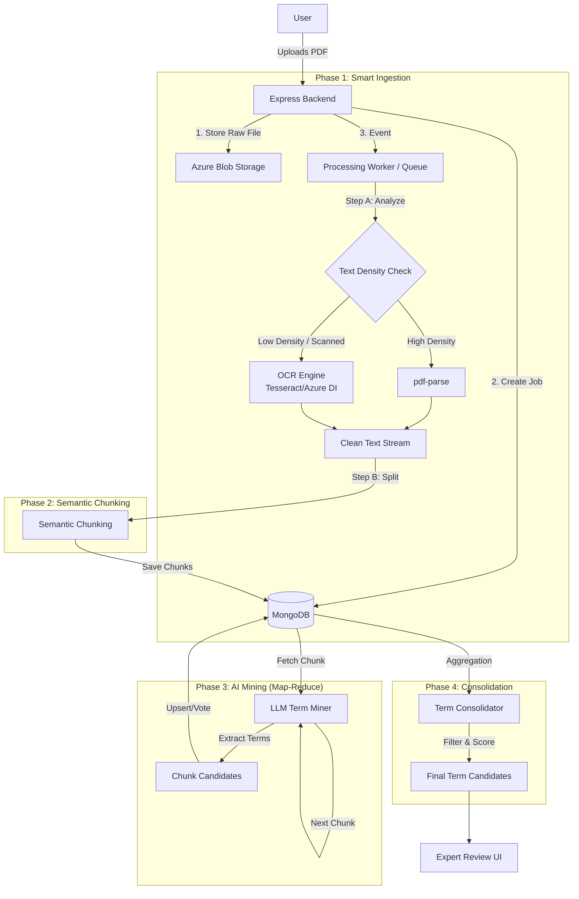

# Expert-Managed Glossary Mining System V2: Technical Design Strategy

> **Role**: Senior AI Systems Architect
> **Objective**: Solve PDF extraction gaps & LLM context limits for large documents.

---

## 1. System Architecture High-Level

We are moving from a synchronous, single-pass memory processing model to an **Asynchronous, Chunk-Based Pipeline**.



---

## 2. Problem 1: Smart PDF Processing Pipeline (Hybrid)

**Goal**: Automatically handle born-digital PDFs, scanned PDFs, and hybrid documents without user intervention.

### A. Detection Logic (The "Router")
Before processing, we analyze the first 3-5 pages to determine the strategy.

1.  **Extract Text Layer**: Use `pdf-parse` on first 3 pages.
2.  **Calculate "Text Density"**: `CharacterCount / PageCount`.
3.  **Heuristic**:
    *   If `Density < 50 chars/page` → **SCANNED MODE** (Use OCR).
    *   If `Density > 50` but extensive "Image XObjects" detected (via `pdf-lib` analysis) → **HYBRID MODE** (Complex, see below).
    *   Else → **TEXT MODE** (Continue with `pdf-parse`).

### B. Implementation Steps (Node.js)

#### 1. Dependencies
*   `pdf-parse`: For text layer.
*   `pdf-lib`: For metadata/page analysis.
*   `tesseract.js` (Free/Local) OR `Azure Document Intelligence` (Premium/Cloud). *Recommendation: Since you use Azure stack, use Azure Document Intelligence 'Read' model for best results, fall back to Tesseract for cost saving.*
*   `sharp`: For image processing if doing local OCR.
*   `pdf-img-convert`: To render PDF pages as images for OCR.

#### 2. The Hybrid Pipeline Code Logic
```javascript
async function smartPdfPipeline(filePath) {
    // 1. Quick Check
    const textLayer = await extractTextLayer(filePath); 
    const density = textLayer.length / getPageCount(filePath);
    
    if (density > 50) {
        console.log("Mode: DIGITAL TEXT");
        return textLayer; // Good to go
    }
    
    // 2. Fallback to OCR (Scanned)
    console.log("Mode: SCANNED IMAGE (OCR Required)");
    
    // Convert pages to images
    const images = await convertPdfToImages(filePath);
    
    // Run OCR (Parallel promise batches)
    const ocrResults = await Promise.all(
        images.map(img => runOcr(img))
    );
    
    return ocrResults.join('\n\n');
}
```

### C. Large File Performance
*   **Stream Processing**: Do not load 300MB PDFs into RAM. Use Node.js Streams.
*   **Batching**: If using OCR, process 5 pages at a time to avoid GC crashes.

---

## 3. Problem 2: Long Document LLM Strategy

**Goal**: Process 300-page documents without hitting `128k` token limits or losing context.

### A. Chunking Strategy
We cannot just pass the whole text. We must split it.

1.  **Recursive Character Split**:
    *   Target Chunk Size: **4,000 tokens** (~15k chars).
    *   Overlap: **500 tokens** (critical for terms cut across boundaries).
2.  **Metadata Preservation**:
    *   Each chunk knows its `PageRange` (e.g., "Page 1-5") for citations.

### B. Map-Reduce for Glossaries

**Concept**: Instead of one giant prompt, we run "Mini-Miners" on each chunk and vote on the results.

#### Step 1: "Map" (Extraction)
Run prompt on Chunk N:
> "Extract domain terms. If you see a term that looks unfinished, look at context."
*Output*: List of `{ term: "Neural Network", translation: "Mạng neuron", confidence: 0.9 }`

#### Step 2: "Reduce" (Consolidation in MongoDB)
We don't just append. We **Upsert** into a `MiningSession` collection.

**Schema:**
```javascript
// MiningSession Model
{
    _id: ObjectId,
    status: "processing", // 'uploading', 'ocr', 'mining', 'completed'
    totalChunks: 50,
    processedChunks: 12, // For progress bar
    candidateTerms: [
        {
            source: "Neural Network",
            target: "Mạng neuron",
            frequency: 5, // Count how many chunks found this
            sources: ["Page 2", "Page 15"],
            avgConfidence: 0.92,
            verified: false
        }
    ]
}
```

**Logic:**
When Chunk N returns "Neural Network":
1.  Check if "Neural Network" exists in `candidateTerms`.
2.  If **Yes**: Increment `frequency`, update `avgConfidence`, add `Page N` to sources.
3.  If **No**: Push new entry.

### C. Consistency across Chunks
*   **Global Context (The "Primer")**: 
    Before mining chunks, run a "Summary Pass" on the first 10k tokens to extract **Top 20 Core Keywords**.
    Pass these Top 20 terms into the prompt of *every* subsequent chunk as "Established Context" to ensure consistent translation of core terms.

---

## 4. UX / UI Strategy

**Goal**: Manage user expectations for long tasks (5-10 mins).

### A. The "Mining Console" UI
Instead of a spinning loader, show a **Process Stepper**.

**Stage 1: Ingestion**
> [x] Upload Complete
> [O] Analyzing Document Structure (OCR active...) 
> *Show "Scanning pages..." animation if OCR is triggered.*

**Stage 2: Intelligence**
> [O] AI Mining in Progress...
> **Progress Bar**: "Processed 12 / 50 segments"
> *Estimated time remaining: 2 mins*

**Stage 3: Review**
> [ ] Finalizing Candidates

### B. Non-Blocking Workflow (Fire & Forget)
1.  User starts mining.
2.  **Notification**: "This file is large (300 pages). We will notify you when it's ready."
3.  User can navigate away to "Glossary List".
4.  The "Glossary List" item shows a generic "Mining..." badge.
5.  **Toast/Email**: " 'Contract_v1.pdf' mining is complete. 120 terms found."

### C. Progressive Disclosure
*   **"Live Stream" (Optional)**: As `candidateTerms` are updated in MongoDB, the UI can poll (every 5s) and show a "Live Counter": *"Found 34 terms so far..."*. This keeps the user engaged.

---

## 5. Implementation Roadmap

### Phase 1: Backend Pipeline (Node.js)
1.  Install `pdf-lib` and `pdf-img-convert` (or configure Azure Document Intelligence).
2.  Create `PdfProcessorService.js` handling the switch between Text/OCR.
3.  Create `ChunkingService.js` implementing RecursiveCharacterSplit.

### Phase 2: Async Logic
1.  Update `miningController.js` to **not await** the full process.
2.  Return `202 Accepted` with a `jobId` immediately.
3.  Trigger the background worker (can be just an async function in Node or a BullMQ queue).

### Phase 3: Frontend Polling
1.  Update `GlossaryManager` to store `activeJobIds`.
2.  Implement `useMiningStatus` hook to poll `/api/mining/:id/status`.
3.  Design the "Progress Stepper" component.

## 6. Prompt Strategy (Chunk-Based)

**Prompt for Chunk N:**
```text
SYSTEM:
You are a glossary extraction engine.
CONTEXT:
We have established these Core Terms from previous sections:
[...List of Top 5 Terms to maintain consistency...]

TASK:
Analyze the following text segment (Chunk {current} of {total}).
Extract new terminology candidates.
If a term matches a Core Term, strictly stick to the established translation.

INPUT TEXT:
...

OUTPUT JSON:
[ { "source": "...", "target": "...", "context": "..." } ]
```
